# Authenticating with other services

One of the key use cases for Packs is integrating Coda with other apps and services, which often involves some form of authentication. When building a Pack you specify the type of authentication required by the API and Coda handles the credentials exchange, token storage, and account management.

[View Sample Code][samples]{ .md-button }


## Using a Pack with authentication

Packs that use system-wide authentication (all users use the Pack makers's credentials) don't require any additional setup by the user, and can be used just like Packs without any authentication.

Packs that support per-user authentication require some additional setup. Users must sign in to their accounts and connect them to Coda, as well as choose which account to authenticate with when using the building blocks from that Pack.


### Connecting an account

The listing for the Pack will display a **Sign in to install** button in place of the usual **Install** button. Upon clicking it the user will immediately be launched into a sign-in flow, which varies depending on the type of authentication used and the service the user is connecting to. After the sign-in flow is complete Coda will ask the user if that connected account should be shared with other users in the same doc.

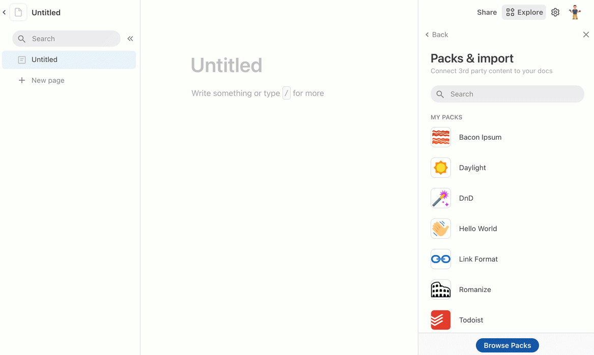

Users can sign in to additional accounts and change their sharing settings from the **Settings** tab of the Pack's side panel. Accounts can be reused across docs, and  users can manage all of their connected accounts on the [Account settings][account_settings] page.


### Selecting an account

In the formula editor the account is shown as the first parameter to the formula, and in the other dialogs the account to use is displayed as a dropdown list.

=== "In the formula editor"
    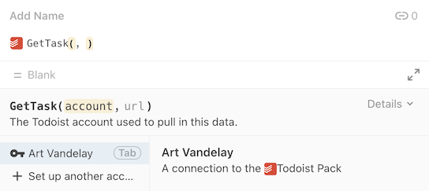
=== "In the action builder"
    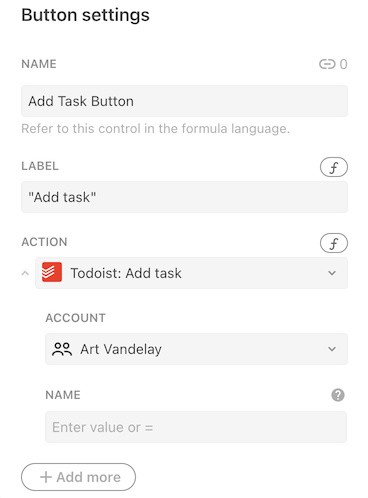
=== "In the column format settings"
    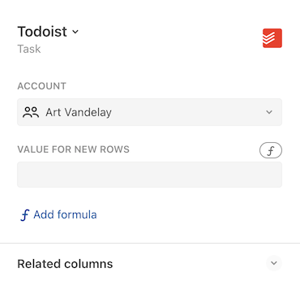
=== "In the sync table settings"
    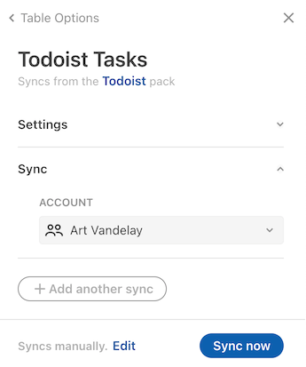


## Adding authentication to your Pack

There are two supported forms of authentication: per-user and system-wide.

### Per-user authentication {: #user}

User authentication requires that users of the Pack provide their own credentials. This is the most common form of authentication, as it allows the Pack to access the private data of each user. To add per-user authentication use the `setUserAuthentication()` method:

```ts
pack.setUserAuthentication({
  // A variety of different authentication types are supported.
  type: coda.AuthenticationType.HeaderBearerToken,
  // Additional settings...
});
```

The types of authentication supported, as well as the additional settings, are described in the sections below.

### System-wide authentication {: #system}

System authentication requires the Pack maker to provide a single set of credentials that all users will share. This form of authentication is often used for APIs that require an API key or token, but don't provide access to private data. To add system-wide authentication use the `setSystemAuthentication()` method:

```ts
pack.setSystemAuthentication({
  // A variety of different authentication types are supported.
  type: coda.AuthenticationType.HeaderBearerToken,
  // Additional settings...
});
```

After adding the code, build a new version of your Pack and then navigate to the **Settings** tab. There you'll see an **Add system authentication** button you can use to set the credentials.

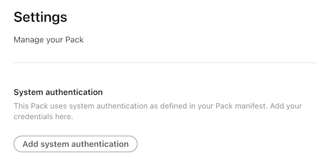

The types of authentication supported, as well as the additional settings, are described in the sections below.


## Authentication types

Coda supports a fixed set of authentication types which cover the most common patterns that APIs use. In addition you can define your own form of [custom token authentication](#custom-tokens) to support more complex scenarios. It's not possible to write completely custom authentication code however, as Coda alone has access to the user's credentials. If your API's authentication needs can't be met by any of these types please [contact support][support].

The sections below will cover some of the most common types of authentication, and you can see the full set in the [`AuthenticationType`][AuthenticationType] enum.


### Simple tokens

Many APIs use tokens or keys for authentication. Per-user tokens are typically generated from a settings screen within the application, while API keys are often generated when registering an app in a developer portal. How you pass these tokens varies depending on the API, and Coda provides built-in support for the most common methods:

=== "Authorization header"

    Use [`HeaderBearerToken`][HeaderBearerToken] authentication for APIs that expect the token to be passed in the `Authorization` header with the prefix `Bearer`. For example:

    ```
    GET /users/me
    Host: api.example.com
    Authorization: Bearer <token>
    ```

    Can be implemented using:

    ```ts
    pack.setUserAuthentication({
      type: coda.AuthenticationType.HeaderBearerToken,
    });
    ```

    [View Sample Code][sample_auth_header]{ .md-button }

=== "Custom header"

    Use [`CustomHeaderToken`][CustomHeaderToken] authentication for APIs that expect the token in a custom header, with an optional prefix. For example:

    ```
    GET /users/me
    Host: api.example.com
    X-API-Key: <token>
    ```

    Can be implemented using:

    ```ts
    pack.setUserAuthentication({
      type: coda.AuthenticationType.CustomHeaderToken,
      headerName: "X-API-Key",
    });
    ```

    [View Sample Code][sample_custom_header]{ .md-button }

=== "Query parameter"

    Use [`QueryParamToken`][QueryParamToken] authentication for APIs that expect the token in a URL query parameter. For example:

    ```
    GET /users/me?key=<token>
    Host: api.example.com
    ```

    Can be implemented using:

    ```ts
    pack.setUserAuthentication({
      type: coda.AuthenticationType.QueryParamToken,
      paramName: "key",
    });
    ```

    [View Sample Code][sample_query_param]{ .md-button }

=== "Multiple query parameters"

    Use [`MultiQueryParamToken`][MultiQueryParamToken] authentication for APIs that expect multiple tokens in URL query parameters. For example:

    ```
    GET /users/me?key=<token>&secret=<secret>
    Host: api.example.com
    ```

    Can be implemented using:

    ```ts
    pack.setUserAuthentication({
      type: coda.AuthenticationType.MultiQueryParamToken,
      params: [
        { name: "key", description: "The key." },
        { name: "secret", description: "The secret." },
      ],
    });
    ```

    [View Sample Code][sample_multiple_query_params]{ .md-button }

---

When using per-user authentication, the user will be prompted to enter their token when connecting their account.

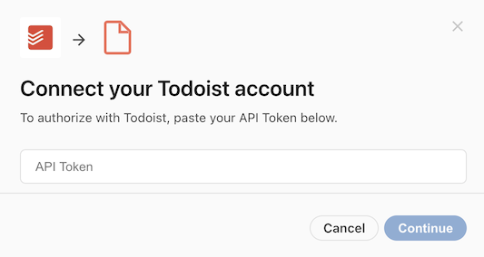

!!! tip "Set an instructions URL"
    It may not be obvious to users where they can find their API token. You can set the `instructionsUrl` field of the authentication configuration to a relevant help center article, or in some cases directly to the screen within the application that lists the API token. Coda will link to this URL in the dialog.
    ```ts
    pack.setUserAuthentication({
      type: coda.AuthenticationType.HeaderBearerToken,
      instructionsUrl: "https://help.example.com/where-is-my-api-token",
    });
    ```


### Custom tokens

Some APIs require a combination of tokens to be used, or for them to be passed in the request body or URL. In these cases you can use the [`Custom`][Custom] authentication type. Consider this example, where a key is passed in the URL and an additional token is passed in the request body:

```
POST /api/<key>/users
Host: api.example.com
Content-Type: application/json

{
  "token": "<token>",
  "name": "Art Vandelay"
}
```

This can be accomplished using a `Custom` authentication configuration like:

```ts
pack.setSystemAuthentication({
  type: coda.AuthenticationType.Custom,
  params: [
    {name: "key", description: "The API key"},
    {name: "token", description: "The account token"},
  ],
});
```

Each token defined within the `params` array will result in an additional prompt in the authentication dialog:

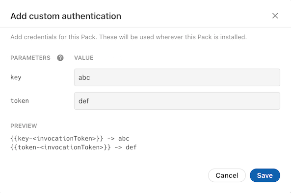


Unlike with other authentication types where the values are added to your fetch requests automatically, with `Custom` authentication you must manually add these tokens to your request. Wherever you need to inject one of these tokens enter a placeholder value instead, and before your request is sent Coda will replace it with the value of the corresponding token. The placeholder format is ``, where `<paramName>` is the name of the token you defined and `<invocateToken>` is the unique ID generated for that execution of your Pack.



```ts
pack.addFormula({
  // ...
  execute: async function ([], context) {
    let invocationToken = context.invocationToken;
    let keyPlaceholder = "{{key-" + invocationToken + "}}";
    let tokenPlaceholder = "{{token-" + invocationToken + "}}";
    let url = "https://api.example.com/api/" + keyPlaceholder + "/users";
    let body = {
      token: tokenPlaceholder,
      name: "Art Vandelay",
    };
    let response = await context.fetcher.fetch({
      method: "POST",
      url: url,
      headers: {
        "Content-Type": "application/json",
      },
      body: JSON.stringify(body),
    });
    // ...
  },
});
```



### Username and password

Some APIs authenticate using a username and password, or an equivalent account identifier and secret. The web has long supported this through the ["Basic" authorization scheme][wikipedia_basic_auth], where the username and password are encoded and passed in the `Authorization` header.

```
GET /users/me
Host: api.example.com
Authorization: Basic <base64 encoded username & password>
```

You can support this by using [`WebBasic`][WebBasic] authentication in your Pack:

```ts
pack.setUserAuthentication({
  type: coda.AuthenticationType.WebBasic,
});
```

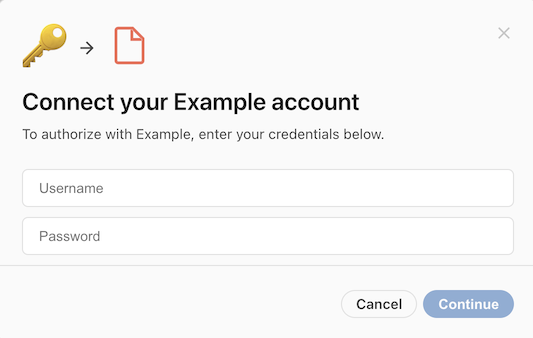

[View Sample Code][sample_web_basic]{ .md-button }

!!! tip "Customize the dialog"
    Sometimes Basic authentication is used for other types of identifiers and secrets, and the terms "Username" and "Password" in the dialog can be misleading. You can customize the dialog using the `uxOptions` field of the authentication configuration.
    ```ts
    pack.setUserAuthentication({
      type: coda.AuthenticationType.WebBasic,
      uxConfig: {
        placeholderUsername: "Account ID",
        placeholderPassword: "Secret Token",
      },
    });
    ```


### Token exchange

Some APIs use short-lived tokens which must be obtained through an credential exchange or approval process. The industry-wide standard for this is OAuth 2.0, which is supported in the Pack SDK. You can read more about it in the [OAuth guide][oauth_guide]. Other forms of token exchange are not currently supported.


### Coda API token

Packs that connect to the Coda API should use [`CodaApiHeaderBearerToken`][CodaApiHeaderBearerToken] authentication, which works much like `HeaderBearerToken` but is optimized for the Coda API. It allows the user to easily create new Coda API tokens directly from the sign-in flow, passing them in the `Authorization` header of outgoing requests. For example:

```
GET /apis/v1/whoami
Host: coda.io
Authorization: Bearer <token>
```

Can be implemented using:

```ts
pack.setUserAuthentication({
  type: coda.AuthenticationType.CodaApiHeaderBearerToken,
});
```

Enabling the option `shouldAutoAuthSetup: true` further simplifies the sign-in experience, automatically creating the Coda API token with default settings.

[View Sample Code][sample_coda_api]{ .md-button }


## Requiring authentication

If a Pack includes any form of user authentication then by default all of the building blocks within that Pack are assumed to require a connected account. You can set the `connectionRequirement` property on individual formulas or sync tables to make an account optional or not used.

```ts
pack.setUserAuthentication({
  // ...
});

pack.addFormula({
  name: "NeedsAuthFormula",
  // ...
});

pack.addFormula({
  name: "NoAuthNeededFormula",
  // ...
  connectionRequirement: coda.ConnectionRequirement.None,
});
```

Alternatively, you can set the `defaultConnectionRequirement` field of the authentication configuration to specify a different default, and then opt-in formulas or sync tables as needed.

```ts
pack.setUserAuthentication({
  // ...
  defaultConnectionRequirement: coda.ConnectionRequirement.None,
});

pack.addFormula({
  name: "NeedsAuthFormula",
  // ...
  connectionRequirement: coda.ConnectionRequirement.Required,
  // ...
});

pack.addFormula({
  name: "NoAuthNeededFormula",
  // ...
});
```


## Setting account names {: #name}

By default the accounts that users connect to will be given the same name as their Coda account. While this works fine the majority of the time, if they are connecting to a team account or multiple accounts it is not very helpful. Therefore we strongly recommend that you implement a [`getConnectionName`][getConnectionName] function in your authentication configuration to set a more meaningful account name. This is typically done by making a Fetcher request to a user information endpoint in the API and then returning the name of the account.

```ts
pack.setUserAuthentication({
  // ...
  getConnectionName: async function(context) {
    let response = await context.fetcher.fetch({
      method: "GET",
      url: "https://api.example.com/users/me",
    });
    return response.body.username;
  },
});
```

This function is run after the user has entered their credentials, and the credentials are automatically applied to the Fetcher request.

[View Sample Code][sample_connection_name]{ .md-button }

!!! tip "Use detailed account names"
    If your service allows users to [connect to multiple endpoints](#endpoints), we recommend that you include the endpoint name as well. For example, a pattern like "User Name (Endpoint Name)".


## Account-specific endpoints {: #endpoints}

Some services host a unique domain or subdomain for each account, and require that API requests be sent there. For example, a user may access the service at `vandelay.example.com` and the API requests should be sent to `vandelay.example.com/api`. This is supported in Packs using account-specific endpoints.

The endpoint URL is determined using one of the methods in the sections below. Once set it's available in your formulas and functions via `context.endpoint`.

```ts
pack.addFormula({
  // ...
  execute: async function ([], context) {
    // Retrieve the endpoint that the user set.
    let endpoint = context.endpoint;
    let url = endpoint + "/api/v1/users/me";
    // ...
  },
});
```

Alternatively you can use a relative URL, and it will have the endpoint URL automatically prepended.

```ts
pack.addFormula({
  // ...
  execute: async function ([], context) {
    // The endpoint URL will be automatically prepended.
    let url = "/api/v1/users/me";
    // ...
  },
});
```


### Entering manually

To require the user to enter the endpoint URL, set the `requiresEndpointUrl` field to `true`. If you are expecting a subdomain, for additional validation set the `endpointDomain` field to the root domain that all subdomains share.

```ts
pack.setUserAuthentication({
  // ...
  requiresEndpointUrl: true,
  endpointDomain: "example.com",
});
```

When the user connects to their account they will now also be asked to provide the endpoint URL for their account.

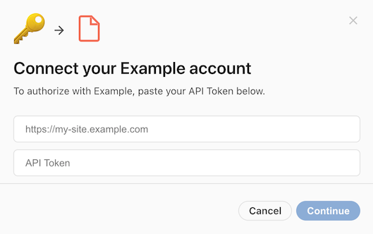

[View Sample Code][sample_manual_endpoint]{ .md-button }

!!! warning "Not compatible with OAuth2"
    Packs that use OAuth2 authentication don't support a manual prompt for the endpoint URL. They should instead use one of the alternate options listed below.


### Extracting from token exchange

Some APIs that use OAuth2 authentication return the endpoint URL during the token exchange, as a custom property within the JSON body:

```json
{
  "access_token": "...",
  "token_type": "bearer",
  "site_url": "https://vandelay.example.com"
}
```

You can automatically extract this value and use it as the endpoint URL by setting the `endpointKey` field of the authentication configuration.

```ts
pack.setUserAuthentication({
  type: coda.AuthenticationType.OAuth2,
  // ...
  endpointKey: "site_url",
});
```

[View Sample Code][sample_automatic_endpoint]{ .md-button }

### Prompting for user selection {: #setendpoint}

If the service allows the same user account to access multiple endpoints, and those endpoints can be determined with an API call, then you can prompt the user to select the endpoint they wish to connect to. This is accomplished using a `postSetup` step of the type `SetEndpoint`.

```ts
pack.setUserAuthentication({
  // After approving access, the user should select which instance they want to
  // connect to.
  postSetup: [{
    type: coda.PostSetupType.SetEndpoint,
    name: "SelectEndpoint",
    description: "Select the site to connect to:",
    // Generate the list of endpoint options.
    getOptions: async function (context) {
      // Make a request to the API to retrieve the sites they can access.
      let response = await context.fetcher.fetch({
        method: "GET",
        url: "https://api.example.com/my/sites",
      });
      let sites = response.body.sites;
      return sites.map(site => {
        return { display: site.name, value: site.url };
      });
    },
  }],
});
```

The step's `getOptions` works like [dynamic autocomplete][autocomplete_dynamic], fetching the list of available endpoints and returning a display name and value for each. After the user enters their credentials they will be prompted to select one of the endpoints in a dialog.

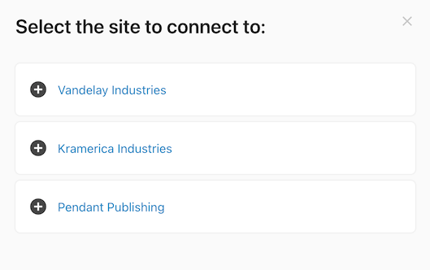

[View Sample Code][sample_selected_endpoint]{ .md-button }

!!! warning "Connection name generated twice"
    When using this feature the [`getConnectionName` function](#setting-account-names) is run multiple times: once before the endpoint is selected and again after. Make sure your code works correctly in both cases. Before the endpoint is available you can return a generic name, which will get overwritten later.


### Network domains

Typically a Pack can only make HTTP requests to the [network domains][network_domains] it declares. If the selected endpoint URL is outside of the Pack's declared domains then requests to it will fail. The `endpointDomain` field in the authentication settings can be used to validate manually entered endpoints provided by users, helping to prevent mistakes.

There are services however where each account is associated with a distinct domain, instead of a sub-domain of a common root domain. This makes it impossible to declare them ahead of time as network domains. In these cases you can omit network domain declaration from your Pack, which will allow it to make requests to the account's endpoint URL (and only that URL) regardless of domain.


[samples]: ../../../samples/topic/authentication.md
[sample_auth_header]: ../../../samples/topic/authentication.md#authorization-header
[sample_custom_header]: ../../../samples/topic/authentication.md#custom-header
[sample_query_param]: ../../../samples/topic/authentication.md#query-parameter
[sample_web_basic]: ../../../samples/topic/authentication.md#username-and-password
[sample_manual_endpoint]: ../../../samples/topic/authentication.md#manual-endpoint
[sample_automatic_endpoint]: ../../../samples/topic/authentication.md#automatic-endpoint
[sample_selected_endpoint]: ../../../samples/topic/authentication.md#selected-endpoint
[sample_connection_name]: ../../../samples/topic/authentication.md#oauth2

[hc_account_sharing]: https://help.coda.io/en/articles/4587167-what-can-coda-access-with-packs
[account_settings]: https://coda.io/account
[AuthenticationType]: ../../../reference/sdk/enums/core.AuthenticationType.md
[support]: ../../../support/index.md
[coda_api_auth]: https://coda.io/developers/apis/v1#section/Authentication
[HeaderBearerToken]: ../../../reference/sdk/enums/core.AuthenticationType.md#headerbearertoken
[CustomHeaderToken]: ../../../reference/sdk/enums/core.AuthenticationType.md#customheadertoken
[QueryParamToken]: ../../../reference/sdk/enums/core.AuthenticationType.md#queryparamtoken
[QueryParamToken]: ../../../reference/sdk/enums/core.AuthenticationType.md#custom
[wikipedia_basic_auth]: https://en.wikipedia.org/wiki/Basic_access_authentication
[WebBasic]: ../../../reference/sdk/enums/core.AuthenticationType.md#webbasic
[Custom]: ../../../reference/sdk/enums/core.AuthenticationType.md#custom
[getConnectionName]: ../../../reference/sdk/interfaces/core.BaseAuthentication.md#getconnectionname
[network_domains]: ../fetcher.md#network-domains
[autocomplete_dynamic]: ../../basics/parameters/autocomplete.md#dynamic-options
[oauth_guide]: oauth2.md
[MultiQueryParamToken]: ../../../reference/sdk/enums/core.AuthenticationType.md#multiqueryparamtoken
[sample_multiple_query_params]: ../../../samples/topic/authentication.md#multiple-query-parameters
[CodaApiHeaderBearerToken]: ../../../reference/sdk/enums/core.AuthenticationType.md#codaapiheaderbearertoken
[sample_coda_api]: ../../../samples/topic/authentication.md#coda-api-token
