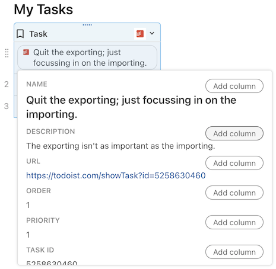

# Return data with meaningful types

Pack formulas are written in JavaScript and can return standard JavaScript data types. Coda however supports a wider array of semantic types that change how the data is displayed to the user. When defining a [formula][formulas] or [schema][schemas] you must specify the type of the data being returned.

[View Sample Code][samples]{ .md-button }


## Value types

The core, underlying type of a value is referred to as its value type. The enumeration [`ValueType`][ValueType] defines the set of supported types, and they correspond to basic data types in JavaScript.

For a formula the value type is specified in the `resultType` property, and for schemas it's specified in the `type` property. The type specified must match the type of the value returned by your code.

=== "Formula"

    ```ts
    pack.addFormula({
      // ...
      resultType: coda.ValueType.String,
      execute: async function ([], context) {
        return "This is a string";
      },
    });
    ```

=== "Schema"

    ```ts
    const MySchema = coda.makeSchema({
      type: coda.ValueType.String,
      // ...
    });
    ```

[View all types][ValueType]{ .md-button }


### Strings

Text values can be returned as [JavaScript strings][mdn_string] using the [`String`][String] value type.

```ts
pack.addFormula({
  // ...
  resultType: coda.ValueType.String,
  execute: async function ([], context) {
    return "Hello World!";
  },
});
```


### Numbers

Number values can be returned as [JavaScript numbers][mdn_number] using the [`Number`][Number] value type.

```ts
pack.addFormula({
  // ...
  resultType: coda.ValueType.Number,
  execute: async function ([], context) {
    return 42;
  },
});
```


### Booleans

True or false values can be returned as [JavaScript booleans][mdn_boolean] using the [`Boolean`][Boolean] value type.

```ts
pack.addFormula({
  // ...
  resultType: coda.ValueType.Boolean,
  execute: async function ([], context) {
    return true;
  },
});
```


### Objects

Structured data can be returned as [JavaScript objects][mdn_object] using the [`Object`][Object] value type. These objects must conform to an defined schema, as specified in the `schema` property. See the [Schemas guide][schemas] for more information about defining and using schemas.

```ts
const MySchema = coda.makeObjectSchema({
  properties: {
    property1: { type: coda.ValueType.String },
    property2: { type: coda.ValueType.Number },
    // ...
  },
  // ...
});

pack.addFormula({
  // ...
  resultType: coda.ValueType.Object,
  schema: MySchema,
  execute: async function ([], context) {
    return {
      property1: "This is a string",
      property2: 42,
      // ...
    };
  },
});
```

Objects are displayed in the doc as a "chip", a small rectangle with rounded corners. The display value is shown within the chip, with additional properties of object shown on hover.



Like Coda tables, the fields within an object can be accessed using dot notation.


### Arrays

Lists of data can be returned as [JavaScript arrays][mdn_array] using the [`Array`][Array] value type. The resulting array is represented as a [`List`][formula_list] in the Coda formula language.

You must also specify the [schema][schemas] of the items in the array, using the `items` property. For arrays of simple data you can define the schema inline, supplying only the `type` key.

```ts
pack.addFormula({
  // ...
  resultType: coda.ValueType.Array,
  items: { type: coda.ValueType.String },
  execute: async function ([], context) {
    return ["This", "is", "a", "string", "array"];
  },
});
```

For arrays of objects, set `items` to the full object schema.

```ts
const MySchema = coda.makeObjectSchema({
  properties: {
    property1: { type: coda.ValueType.String },
    property2: { type: coda.ValueType.Number },
  },
  // ...
});

pack.addFormula({
  // ...
  resultType: coda.ValueType.Array,
  items: MySchema,
  execute: async function ([], context) {
    return [
      { property1: "This is a string", property2: 42 },
      { property1: "Another string", property2: 100 },
    ];
  },
});
```


## Value hints

To indicate that Coda should display your value in a more meaningful way you can set a value hint. The enumeration [`ValueHintType`][ValueHintType] defines the set of supported value hints, which correspond to the [column formats][column_formats] in Coda. The value hint is set one using the `codaType` property of a formula or schema. Hints can only be used with certain value types, for example the `Percent` value hint can only be used with the `Number` value type.

```ts
pack.addFormula({
  name: "HalfWayThere",
  // ...
  resultType: coda.ValueType.Number,
  codaType: coda.ValueHintType.Percent,
  execute: async function ([], context) {
    return 50;
  },
});
```

[View all hints][ValueHintType]{ .md-button }


### Markdown {. #markdown}

The [`Markdown`][hint_markdown] value hint indicates that Coda should parse the returned string as markdown and render it as rich text. The value can contain [basic markdown syntax][markdown], but extensions used by other applications (like tables, emoji, etc) are not supported.

```ts
pack.addFormula({
  // ...
  resultType: coda.ValueType.String,
  codaType: coda.ValueHintType.Markdown,
  execute: async function ([], context) {
    return "This is _so_ **cool**!";
  },
});
```

<!-- TODO: Fully document the allowed markup. -->


### HTML

The [`Html`][hint_html] value hint indicates that Coda should parse the returned string as HTML and render it as rich text. Code only supports a small subset of HTML markup, limited to the basic formatting you can accomplish in [markdown](#markdown).

```ts
pack.addFormula({
  // ...
  resultType: coda.ValueType.String,
  codaType: coda.ValueHintType.Html,
  execute: async function ([], context) {
    return "This is <i>so</i> <b>cool</b>!";
  },
});
```

<!-- TODO: Fully document the allowed markup. -->


### Dates and times {: #dates}

The [`Date`][Date], [`Time`][Time], and [`DateTime`][DateTime] value hints can be applied to either `String` or `Number` values.

When used with a string value, Coda attempts to parse the value, and is able to parse a wide variety of date and time formats. For maximum compatibility however use the [ISO 8601][ISO_8601] format. When using a JavaScript `Date` object this can be obtained by calling `toISOString()`. If the string doesn't include a timezone identifier or offset then Coda will assume it's already in the timezone of the document. See the [Timezones guide][timezones] for more information about how timezones affect return values.

When used with a number value, the number should contain the number of seconds since the [Unix epoch][unix_epoch] (00:00:00 UTC on 1 January 1970). When using a JavaScript `Date` object this can be obtained by calling `getTime()` and dividing by 1000.

=== "From String"

    ```ts
    pack.addFormula({
      // ...
      resultType: coda.ValueType.String,
      codaType: coda.ValueHintType.DateTime,
      execute: async function ([], context) {
        let now = new Date();
        return now.toISOString();
      },
    });
    ```

=== "From Number"

    ```ts
    pack.addFormula({
      // ...
      resultType: coda.ValueType.Number,
      codaType: coda.ValueHintType.DateTime,
      execute: async function ([], context) {
        let now = new Date();
        return now.getTime() / 1000;
      },
    });
    ```

!!! warning
    The `Date` and `Time` value hints currently only work correctly within a sync table. When used outside of a sync table both the date and time parts of the returned date will be visible, as if `DateTime` was used.


### Durations {: #durations}

The [`Duration`][Duration] value hint represents an amount of time, rather than a specific time. It can be applied to `Number` or `String` values. For numbers, the value represents the number of days (fractional amounts allowed). For strings, the value must match one of a few formats:

| Example                     | Result              | Notes                           |
| --------------------------- | ------------------- | ------------------------------- |
| 6                           | 6 days              | A single number is days.        |
| 6:01                        | 6 hrs 1 min         | Hours and minutes.              |
| 6:01:15                     | 6 hrs 1 min 15 secs | Hours, minutes, and seconds.    |
| 6 hours 1 minute 15 seconds | 6 hrs 1 min 15 secs | Full units.                     |
| 6 hrs 1 min 15 secs         | 6 hrs 1 min 15 secs | Abbreviated units.              |
| 6 hrs, 1 min, 15 secs       | 6 hrs 1 min 15 secs | Commas allowed.                 |
| 0.25 days, 1 min, 15 secs   | 6 hrs 1 min 15 secs | Fractional amounts allowed.     |
| 72000 minutes               | 50 days             | Don't use thousands separators. |

 Any duration value your Pack returns will automatically be converted into its most user-friendly form by Coda. For example, `3600 seconds` will be shown to the user as **1 hr**.

```ts
pack.addFormula({
  // ...
  resultType: coda.ValueType.String,
  codaType: coda.ValueHintType.Duration,
  execute: async function ([], context) {
    return "525600 minutes";
  },
});
```

### Percentages

Formulas that return a result as a percentage can use the value type `Number` and the value hint [`Percent`][Percent]. Return a fraction in your code and the doc will display the equivalent percentage.

```ts
pack.addFormula({
  // ...
  resultType: coda.ValueType.Number,
  codaType: coda.ValueHintType.Percent,
  execute: async function ([], context) {
    return 0.5; // Displayed as "50%" in the doc.
  },
});
```


### Images {: #images}

There are two different value hints for image: [`ImageReference`][ImageReference] and [`ImageAttachment`][ImageAttachment]. Both of these are applied to string values, where the string contains the URL of the image. For image references, the image is always loaded from the source URL. For image attachments, Coda copies the image from the source URL into the document and shows that local copy.

Image attachments should be used in most cases. An image reference may make more sense if you expect the image to be updated often and want to ensure the doc is always using the latest copy, or when contractually obligated to hotlink to the image.

```ts
pack.addFormula({
  // ...
  resultType: coda.ValueType.String,
  codaType: coda.ValueHintType.ImageReference,
  execute: async function ([], context) {
    return "https://via.placeholder.com/150";
  },
});
```

!!! bug
    Image attachments currently only work correctly within a sync table. When used outside of a sync table they behave like image references and load the image from the source URL.


### Files {: #files}

Similar to `ImageAttachment` mentioned above, you can return other file types using the value hint `Attachment`. This hint is also applied to string values, where the string contains the URL of the file. Coda copies the file from the source URL into the document and uses that local copy.

```ts
const DealSchema = coda.makeObjectSchema({
  properties: {
    // ...
    contract: {
      type: coda.ValueType.String,
      codaType: coda.ValueHintType.Attachment,
    },
  },
  // ...
});
```

!!! bug
    Attachments currently only work within a sync table.
    <!-- https://golinks.io/bug/21522 -->
    Additionally, file attachments may be shown with the wrong file name.
    <!-- https://golinks.io/bug/21523 -->


### Embedded content

The [`Embed`][Embed] value hint can be used to embed external content in the Coda doc. This value hint can be applied to `String` values, where the string contains the URL to the external content.

```ts
pack.addFormula({
  // ...
  resultType: coda.ValueType.String,
  codaType: coda.ValueHintType.Embed,
  execute: async function ([], context) {
    return "https://www.youtube.com/watch?v=oLYZv68M3Kg";
  },
});
```

Read the [Embedding content][embeds] guide to learn more.


### People

The [`Person`][Person] value hint can be used to @-reference a Coda user account. This hint can be applied to `Object` values, where the object has a property that specifies the user's email address. The email address must be contained within the property of the object that is listed as its `idProperty` within the schema definition, and that property must be marked as `required`.

```ts
const MyPersonSchema = coda.makeObjectSchema({
  codaType: coda.ValueHintType.Person,
  properties: {
    name: {type: coda.ValueType.String},
    email: { type: coda.ValueType.String, required: true },
  },
  displayProperty: "name",
  idProperty: "email",
});
```

When no Coda user with the given email address is found the object will render as a normal object chip.

!!! warning
    This value hint currently only work correctly within a sync table. When used outside of a sync table it will render as a normal object chip, as if no value hint was applied.


### Row reference

The [`Reference`][Reference] value hint can be used to reference a row in a sync table. See the [Schemas guide][schemas_references] for more information about defining and using schema references.

!!! warning
    This value hint currently only work correctly within a sync table. When used outside of a sync table it will render as a normal object chip, as if no value hint was applied.


## Corresponding column types {:#column-types}

The columns of a Coda table are strongly typed, and the data types in the Pack SDK roughly correspond to those same types. The table below indicates the value type and value hint that corresponds to a each column type.

| Column type   | Supported | Value type               | Value hint        | Options                                                                                       |
| ------------- | --------- | ------------------------ | ----------------- | --------------------------------------------------------------------------------------------- |
| Text          | ✅ Yes     | `String`                 |                   |                                                                                               |
| Link          | ✅ Yes     | `String`                 | `Url`             | [`LinkSchema`][LinkSchema]                                                                    |
| Embed[^1]         | ✅ Yes     | `String`                 | `Embed`           | [`StringEmbedSchema`][StringEmbedSchema]                                                      |
| Canvas        | ❌ No      |                          |                   |                                                                                               |
| Select list   | ❌ No      |                          |                   |                                                                                               |
| Number        | ✅ Yes     | `Number`                 |                   | [`NumericSchema`][NumericSchema]                                                              |
| Percent       | ✅ Yes     | `Number`                 | `Percent`         | [`NumericSchema`][NumericSchema]                                                              |
| Currency      | ✅ Yes     | `Number`                 | `Currency`        | [`CurrencySchema`][CurrencySchema]                                                            |
| Slider        | ✅ Yes[^2]     | `Number`                 | `Slider`          | [`SliderSchema`][SliderSchema]                                                                |
| Progress      | ✅ Yes[^2]     | `Number`                 | `ProgressBar`     | [`ProgressBarSchema`][ProgressBarSchema]                                                      |
| Scale         | ✅ Yes[^2]     | `Number`                 | `Scale`           | [`Scalechema`][SliderSchema]                                                                  |
| Date          | ✅ Yes     | `String` or<br>`Number`  | `Date`            | [`StringDateSchema`][StringDateSchema] or<br>[`NumericDateSchema`][NumericDateSchema]         |
| Time          | ✅ Yes     | `String` or<br> `Number` | `Time`            | [`StringTimeSchema`][StringDateSchema] or<br>[`NumericTimeSchema`][NumericDateSchema]         |
| Date and time | ✅ Yes     | `String` or<br> `Number` | `DateTime`        | [`StringDateTimeSchema`][StringDateSchema] or<br>[`NumericDateTimeSchema`][NumericDateSchema] |
| Duration      | ✅ Yes     | `String` or<br>`Number`  | `Duration`        | [`DurationSchema`][DurationSchema] or<br>[`NumericDurationSchema`][NumericDurationSchema]     |
| Checkbox      | ✅ Yes[^2]     | `Boolean`                |                   |                                                                                               |
| Toggle        | ✅ Yes[^2]     | `Boolean`                | `Toggle`          |                                                                                               |
| People        | ✅ Yes     | `Object`                 | `Person`          |                                                                                               |
| Email         | ✅ Yes     | `String`                 | `Email`           | [`EmailSchema`][EmailSchema]                                                                  |
| Reaction      | ❌ No      |                          |                   |                                                                                               |
| Button        | ❌ No[^3]  |                          |                   |                                                                                               |
| Image         | ✅ Yes     | `String`                 | `ImageAttachment` | [`ImageSchema`][ImageSchema]                                                                  |
| Image URL     | ✅ Yes     | `String`                 | `ImageReference`  | [`ImageSchema`][ImageSchema]                                                                  |
| File          | ✅ Yes     | `String`                 | `Attachment`      |                                                                                               |
| Relation      | ✅ Yes     | `Object`                 | `Reference`       |                                                                                               |

[^1]: Embed isn't a column type in Coda, but it can be used in a table or on the canvas to embed content.
[^2]: Control column types will only render correctly in a sync table, and will not be interactive.
[^3]: While a Pack can't return a button directly, it can provide [actions][actions] that a user can use to power their buttons.


## Formatting options

Some value types and hints support additional formatting options. For example, `Number` types support a [`precision`][precision] option that controls how many decimal places to show, and `Currency` supports a [`currencyCode`][currencyCode] option that determine the currency symbol to show. These options are set in a schema, and for a formula result this may meaning adding a `schema` property to the formula definition.

=== "Formula"

    ```ts
    pack.addFormula({
      name: "GetPrice",
      // ...
      resultType: coda.ValueType.Number,
      schema: {
        type: coda.ValueType.Number,
        codaType: coda.ValueHintType.Currency,
        currencyCode: "EUR",
        precision: 2,
      },
      // ...
    });
    ```

=== "Schema"

    ```ts
    const PriceSchema = coda.makeSchema({
      type: coda.ValueType.Number,
      codaType: coda.ValueHintType.Currency,
      currencyCode: "EUR",
      precision: 2,
    });
    ```

The full set of formatting options for a given value type and hint can be found in the **Options** column of the [table above](#column-types).


[samples]: ../../samples/topic/data-type.md
[formulas]: ../blocks/formulas.md
[schemas]: ../advanced/schemas.md
[schemas_references]: ../advanced/schemas.md#references
[ValueType]: ../../reference/sdk/enums/core.ValueType.md
[String]: ../../reference/sdk/enums/core.ValueType.md#string
[Number]: ../../reference/sdk/enums/core.ValueType.md#number
[Boolean]: ../../reference/sdk/enums/core.ValueType.md#boolean
[Array]: ../../reference/sdk/enums/core.ValueType.md#array
[Object]: ../../reference/sdk/enums/core.ValueType.md#object
[ValueHintType]: ../../reference/sdk/enums/core.ValueHintType.md
[Date]: ../../reference/sdk/enums/core.ValueHintType.md#date
[Percent]: ../../reference/sdk/enums/core.ValueHintType.md#percent
[Time]: ../../reference/sdk/enums/core.ValueHintType.md#time
[DateTime]: ../../reference/sdk/enums/core.ValueHintType.md#datetime
[Duration]: ../../reference/sdk/enums/core.ValueHintType.md#duration
[ImageAttachment]: ../../reference/sdk/enums/core.ValueHintType.md#imageattachment
[ImageReference]: ../../reference/sdk/enums/core.ValueHintType.md#imagereference
[Embed]: ../../reference/sdk/enums/core.ValueHintType.md#embed
[Person]: ../../reference/sdk/enums/core.ValueHintType.md#person
[Reference]: ../../reference/sdk/enums/core.ValueHintType.md#reference
[markdown]: https://www.markdownguide.org/basic-syntax/
[markdown_code_fenced]: https://www.markdownguide.org/extended-syntax/#fenced-code-blocks
[markdown_code_indent]: https://www.markdownguide.org/basic-syntax/#code-blocks
[markdown_checkbox_list]: https://www.markdownguide.org/extended-syntax/#task-lists
[markdown_strikethrough]: https://www.markdownguide.org/extended-syntax/#strikethrough
[markdown_automatic_links]: https://www.markdownguide.org/extended-syntax/#automatic-url-linking
[hint_markdown]: ../../reference/sdk/enums/core.ValueHintType.md#markdown
[hint_html]: ../../reference/sdk/enums/core.ValueHintType.md#html
[ISO_8601]: https://en.wikipedia.org/wiki/ISO_8601
[unix_epoch]: https://en.wikipedia.org/wiki/Unix_time
[iframely]: https://iframely.com/
[oEmbed]: https://oembed.com/
[embed_force]: https://help.coda.io/en/articles/1211364-embedding-content-in-your-doc#using-the-force-parameter
[column_formats]: https://help.coda.io/en/articles/1235680-overview-of-column-formats
[actions]: ../blocks/actions.md
[precision]: ../../reference/sdk/interfaces/core.NumericSchema.md#precision
[currencyCode]: ../../reference/sdk/interfaces/core.CurrencySchema.md#currencycode
[NumericSchema]: ../../reference/sdk/interfaces/core.NumericSchema.md
[CurrencySchema]: ../../reference/sdk/interfaces/core.CurrencySchema.md
[SliderSchema]: ../../reference/sdk/interfaces/core.SliderSchema.md
[ScaleSchema]: ../../reference/sdk/interfaces/core.ScaleSchema.md
[NumericDateSchema]: ../../reference/sdk/interfaces/core.NumericDateSchema.md
[NumericTimeSchema]: ../../reference/sdk/interfaces/core.NumericTimeSchema.md
[NumericDateTimeSchema]: ../../reference/sdk/interfaces/core.NumericDateTimeSchema.md
[StringDateSchema]: ../../reference/sdk/interfaces/core.StringDateSchema.md
[StringTimeSchema]: ../../reference/sdk/interfaces/core.StringTimeSchema.md
[StringDateTimeSchema]: ../../reference/sdk/interfaces/core.StringDateTimeSchema.md
[DurationSchema]: ../../reference/sdk/interfaces/core.DurationSchema.md
[StringEmbedSchema]: ../../reference/sdk/interfaces/core.StringEmbedSchema.md
[ImageSchema]: ../../reference/sdk/interfaces/core.ImageSchema.md
[NumericDurationSchema]: ../../reference/sdk/interfaces/core.NumericDurationSchema.md
[LinkSchema]: ../../reference/sdk/interfaces/core.LinkSchema.md
[ProgressBarSchema]: ../../reference/sdk/interfaces/core.ProgressBarSchema.md
[EmailSchema]: ../../reference/sdk/interfaces/core.EmailSchema.md
[formula_list]: https://coda.io/formulas#List
[embeds]: ../advanced/embeds.md
[timezones]: ../advanced/timezones.md
[mdn_string]: https://developer.mozilla.org/en-US/docs/Web/JavaScript/Reference/Global_Objects/String
[mdn_number]: https://developer.mozilla.org/en-US/docs/Web/JavaScript/Reference/Global_Objects/Number
[mdn_boolean]: https://developer.mozilla.org/en-US/docs/Web/JavaScript/Reference/Global_Objects/Boolean
[mdn_array]: https://developer.mozilla.org/en-US/docs/Web/JavaScript/Reference/Global_Objects/Array
[mdn_object]: https://developer.mozilla.org/en-US/docs/Web/JavaScript/Reference/Global_Objects/Object
