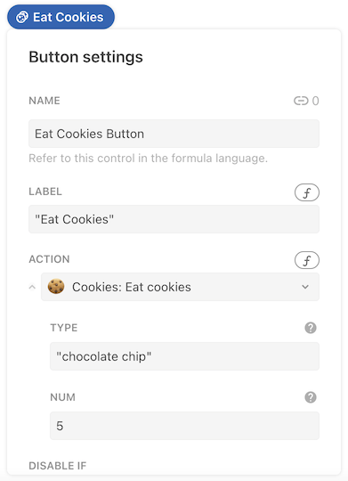
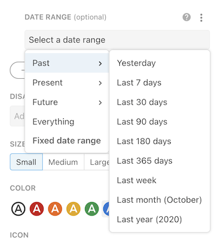

# Accept input with parameters

The primary mechanism for passing data from the user or document into your Pack is via parameters. You define the parameters in your code and the user fills them with values when they use your Pack. The same parameter mechanism is used by formulas, actions, and sync tables.

[View Sample Code][samples]{ .md-button }

## Using parameters

In the formula editor parameters are entered as comma-separated values, while in the action dialog or sync table side panel they presented as input boxes.

=== "In the formula editor"
    
=== "In the action builder"
    
=== "In the sync table settings"
    

## Defining parameters

The [`parameters`][parameters] property of a formula contains the array of parameter definitions, each one containing information about the parameter. The helper function [`makeParameter()`][makeParameter] is used to create these definitions, and a `type`, `name`, and `description` are required.

```ts
coda.makeParameter({
  type: coda.ParameterType.String,
  name: "type",
  description: "The type of cookie.",
})
```

See [`ParamDef`][ParamDef] for the full set of properties you can define for a parameter.

## Accessing parameter values

At runtime, the values set by the user are passed to the formula's `execute` function as the first argument, bundled up as an array.

```ts
pack.addFormula({
  // ...
  parameters: [
    coda.makeParameter({
      type: coda.ParameterType.String,
      name: "type",
      description: "The type of cookie.",
    }),
    coda.makeParameter({
      type: coda.ParameterType.Number,
      name: "num",
      description: "How many cookies.",
    }),
  ],
  // ...
  execute: async function ([type, num], context) {
    // ...
  },
});
```

The order that you define the parameters determines the order they are passed into the `execute` function. The names of the parameters don't need to match the variable names you use for them in the `execute` function, but it's usually more readable to keep them the same.

??? "Array destructuring"
    In the code above, and across our other samples, we typically use [array destructuring][destructuring_assignment] to pull values out of the parameter array and assign them to variables. You could alternatively do that within the body of the `execute` function:

    ```ts
    execute: async function (parameters, context) {
      let word = parameters[0];
      let count = parameters[1];
    },
    ```


## Optional parameters

By default all parameters you define are required. To make a parameter optional simply add `optional: true` to your parameter definition. Optional parameters are shown to the user but not required in order for the formula to execute.  Optional parameters must be defined after all of the required parameters, and like required parameters their order is reflected in the Coda formula editor and the array of values passed to the `execute` function.


```ts
pack.addFormula({
  // ...
  parameters: [
    coda.makeParameter({
      type: coda.ParameterType.String,
      name: "name",
      description: "The person's name.",
    }),
    coda.makeParameter({
      type: coda.ParameterType.String,
      name: "suffix",
      description: "A suffix, like 'MD' or 'Jr'.",
      optional: true,
    }),
  ],
  // ...
  execute: async function ([name, suffix], context) {
    // ...
  },
});
```

Optional parameters that have not been set by the user will default to the JavaScript value `undefined` in your `execute` function. When you initialize your parameter variables in the `execute` function you can assign a default value that will get used when the parameter has not been explicitly set by the user.

```ts
--8<-- "examples/parameter/scream.ts"
```

When using a formula with optional parameters, the user may choose to set those parameters by name, instead of by position. This can be useful when they want to skip over some optional parameters that appear earlier in the list.

```ts
Scream("What is this", character: "?")
```

In this case the `text` and `character` parameters would be set, but the `volume` parameter would be undefined, and therefore use it's default value of `3`.


## Suggested values

As a convenience to users of your Pack, you can provide a suggested value for a parameter. When they use your formula the default will be pre-populated in the formula editor, action dialog, etc. The user is then free to edit or replace it this value.

To add a suggested value to a parameter set the field `defaultValue` to the value you'd like to use. The suggested value must be of the same type as the parameter, for example a number parameter must have a number as it's suggested default value.

```ts
coda.makeParameter({
  type: coda.ParameterType.Number,
  name: "days",
  description: "How many days of data to fetch.",
  defaultValue: 30,
})
```

Currently suggested values are only used for required parameters, and setting them for optional parameters has no effect.


## Accepting multiple values

For some formulas you may want to allow the user to enter multiple values for a parameter. You could use an array parameter for this case but a more user-friendly approach may be to use variable argument (vararg) parameters. These are parameters that you allow the user to repeat as many times as needed.

```
Foo(List("A", "B", "C"))  # A string array parameter.
Foo("A", "B", "C")        # A string variable argument parameter.
```

They are defined using the `varargParameters` property and accept the same parameter objects. The values set by the user are passed in to the `execute` just like normal parameters, only there is an unknown number of them. The easiest way to access them is by using [JavaScript's "rest" syntax][mdn_rest], which captures the remaining values into an array.

```ts
pack.addFormula({
  // ...
  parameters: [
    coda.makeParameter({
      type: coda.ParameterType.String,
      name: "name",
      description: "The person's name.",
    }),
  ],
  varargParameters: [
    coda.makeParameter({
      type: coda.ParameterType.String,
      name: "nickname",
      description: "A nickname for the person.",
    }),
  ],
  // ...
  execute: async function ([name, ...nicknames], context) {
    // ...
  },
});
```

There are some important differences between vararg parameters and standard parameters:

- They appear at the end of the formula, after all standard parameters.
- Unlike standard parameters they are optional by default, and cannot by made required.
- You can't provide a default value, since the user must always enter an explicit value.
- You can have more than one, but if so the user is required to enter complete sets of values. For example, if you have two vararg parameters `a` and `b`, the user can't provide a value for `a` without also providing a value for `b`. These pairs of parameters can then be repeated multiple times: `Foo("a1", "b1", "a2", "b2")`.

```ts
--8<-- "examples/parameter/steps.ts"
```


## Autocomplete

If you have a parameter that accepts a limited set of values it's usually best to provide those options using autocomplete. See the [Autocomplete guide][autocomplete] for more information.


## Reusing parameters

It's often the case that many formulas in a Pack use the same parameter. For example, the [Google Calendar Pack][calendar_pack] has many formulas have a parameter for the calendar to operate on. Rather than redefine the same parameter for each formula, it can be more efficient to define the shared parameter once outside of a formula and then reuse it multiple times.


```ts
const ProjectParam = coda.makeParameter({
  type: coda.ParameterType.String,
  name: "projectId",
  description: "The ID of the project.",
});

pack.addFormula({
  name: "GetProject",
  description: "Get a project.",
  parameters: [
    ProjectParam,
  ],
  // ...
});

pack.addFormula({
  name: "GetTask",
  description: "Get a task within a project.",
  parameters: [
    ProjectParam,
    coda.makeParameter({
      type: coda.ParameterType.String,
      name: "taskId",
      description: "The ID of the task.",
    }),
  ],
  // ...
});
```


## Date range parameters

Parameters of the type `DateArray` are often used for date ranges, with the first date representing the start of the range and the second date representing the end. When a `DateArray` parameter is used in an action or sync table the the input box displays a date range picker to make it easier for the user to select a range.



These parameters also support a special set of [suggested values](#suggested-values) that represent date ranges relative to the current date. These are available in the [`PrecannedDateRange`][PrecannedDateRange] enumeration.

```ts
coda.makeParameter({
  type: coda.ParameterType.DateArray,
  name: "dateRange",
  description: "The date range over which data should be fetched.",
  defaultValue: coda.PrecannedDateRange.Last30Days,
})
```


[samples]: ../../samples/topic/parameter.md
[parameters]: ../../reference/sdk/interfaces/PackFormulaDef.md#parameters
[makeParameter]: ../../reference/sdk/functions/makeParameter.md
[ParamDef]: ../../reference/sdk/interfaces/ParamDef.md
[destructuring_assignment]: https://developer.mozilla.org/en-US/docs/Web/JavaScript/Reference/Operators/Destructuring_assignment
[mdn_rest]: https://developer.mozilla.org/en-US/docs/Web/JavaScript/Reference/Operators/Destructuring_assignment#assigning_the_rest_of_an_array_to_a_variable
[autocomplete]: ../advanced/autocomplete.md
[PrecannedDateRange]: ../../reference/sdk/enums/PrecannedDateRange.md
[calendar_pack]: https://coda.io/packs/google-calendar-1003/documentation
