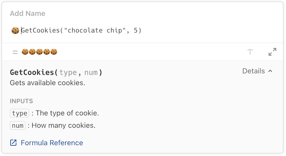
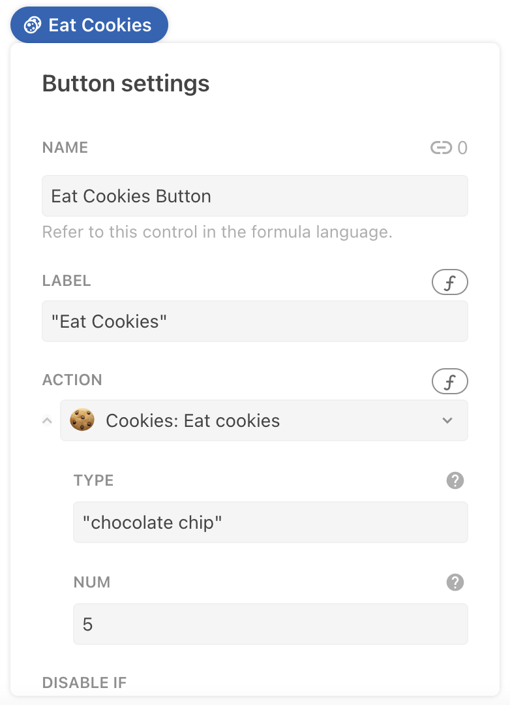
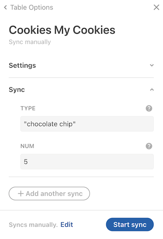
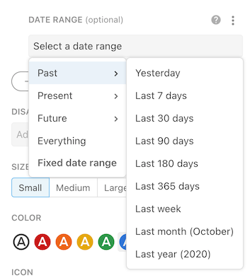

# Accept input with parameters

The primary mechanism for passing data from the user or document into your Pack is via parameters. You define the parameters in your code and the user fills them with values when they use your Pack. The same parameter mechanism is used by formulas, actions, and sync tables.

[View Sample Code][samples]{ .md-button }

## Using parameters

In the formula editor parameters are entered as comma-separated values, while in the action dialog or sync table side panel they presented as input boxes.

=== "In the formula editor"
    
=== "In the action builder"
    
=== "In the sync table settings"
    

## Defining parameters

The [`parameters`][parameters] property of a formula contains the array of parameter definitions, each one containing information about the parameter. The helper function [`makeParameter()`][makeParameter] is used to create these definitions, and a `type`, `name`, and `description` are required.

```ts
coda.makeParameter({
  type: coda.ParameterType.String,
  name: "type",
  description: "The type of cookie.",
})
```

See [`ParamDef`][ParamDef] for the full set of properties you can define for a parameter.

## Accessing parameter values

At runtime, the values set by the user are passed to the formula's `execute` function as the first argument, bundled up as an array.

```ts
pack.addFormula({
  // ...
  parameters: [
    coda.makeParameter({
      type: coda.ParameterType.String,
      name: "type",
      description: "The type of cookie.",
    }),
    coda.makeParameter({
      type: coda.ParameterType.Number,
      name: "num",
      description: "How many cookies.",
    }),
  ],
  // ...
  execute: async function ([type, num], context) {
    // ...
  },
});
```

The order that you define the parameters determines the order they are passed into the `execute` function. The names of the parameters don't need to match the variable names you use for them in the `execute` function, but it's usually more readable to keep them the same.

??? "Array destructuring"
    In the code above, and across our other samples, we typically use [array destructuring][destructuring_assignment] to pull values out of the parameter array and assign them to variables. You could alternatively do that within the body of the `execute` function:

    ```ts
    execute: async function (parameters, context) {
      let word = parameters[0];
      let count = parameters[1];
    },
    ```


## Parameter types {: #types}

When defining a parameter you must specify what type of data the parameter will accept. The enum [`ParameterType`][ParameterType] lists all of the allowed parameter types.


### Plain text

Use the `String` parameter to pass a plain text value to your formula. Coda will automatically apply the [`ToText()`][ToText] formula to the input and pass it to the `execute` function as a [JavaScript String][mdn_string].

String parameters are compatible with almost every column type in Coda, as most have a text representation. At times a string parameter may be better than a more semantically accurate type, as it allows you to access the value as shown to the user.

??? example "Example: Hello world formula"
    ```ts
    --8<-- "examples/hello_world/minimal.ts"
    ```


### Rich text {: #rich}

Use the `Html` parameter type to pass text values with formatting included. Coda will convert the formatting to an equivalent block of HTML markup, and pass it to the `execute` function as a [JavaScript String][mdn_string].

Like string parameters, HTML parameters can accept a wide array of column types. The generated HTML may be quite different than how it displays in Coda however, and is closer to what you'd get if you pasted that value into another rich text editor.

!!! warning "HTML markup may change"
    The generated HTML for a given value is not a stable API surface that you should rely on. We may change it at any time without warning, so we don't recommend that you parse it to extract information. Use it for display purposes only.


### Numbers

Use the `Number` parameter type to pass a number to your formula. Coda will automatically apply the [`ToNumber()`][ToNumber] formula to the input and pass it to the `execute` function as a [JavaScript Number][mdn_number].

The number equivalent for some column types may not be obvious. Specifically:

- **Percent** values will be converted into the equivalent fraction. For example, "75%" will be passed as `0.75`.
- **Date** and **Date and time** values will be converted into the number of days since 1899-12-30[^1]. For example, "1955-11-12" will be passed as `20405`.
- **Time** and **Duration** values will be converted into a number of days. For example, "12 hrs" will be passed as `0.5`.

??? example "Example: Pizza eaten formula"
    ```ts
    --8<-- "examples/data-type/pizza_eaten.ts"
    ```


### Booleans

Use the `Boolean` parameter type to pass a boolean (true/false) to your formula. Coda will pass the value to the `execute` function as a [JavaScript Boolean][mdn_boolean].


### Dates {: #dates}

Use the `Date` parameter type to pass a date value to your formula. Coda will automatically apply the [`ToDateTime()`][ToDateTime] formula to the input and pass it to the `execute` function as a [JavaScript Date][mdn_date].

JavaScript Date objects can only represent a specific moment in time. This means that they can't easily represent less specific concepts like a day (regardless of time), a time (regardless of day), or duration. Coda handles those column types using the following logic:

- **Date** values will be converted into a datetime representing midnight on that day in the document's timezone.
- **Time** and **Duration** values will be converted a datetime that is that much time past midnight on 1899-12-30[^1], in the document's timezone. For example, the duration "12 hours" in a document set to "America/New York" will be passed as `Sat Dec 30 1899 12:00:00 GMT-0500 (Eastern Standard Time)`.

!!! warning "Timezone shifting"
    Because of how timezones work in Coda and JavaScript, the date passed into the parameter may appear different in your Pack code. See the [Timezones guide][timezones] for more information.

??? example "Example: Good New Years Eve glasses formula"
    ```ts
    --8<-- "examples/dates/nye_glasses.ts"
    ```


### Images and files {: #images}

Use the `Image` parameter type to pass an image to your formula, and the `File` type for files. The value passed to the `execute` function will be the URL of that image or file.

Images and files that the user uploaded to the doc will be hosted on the `codahosted.io` domain and don't require authentication to access. These URLs are temporary, and you should not rely on them being accessible after the Pack execution has completed.

If you need access to the binary content of the image or file you'll need to use the [fetcher][fetcher_binary_response] to retrieve it. The fetcher is automatically allowed access to the `codahosted.io` domain, so no need to declare it as a [network domain][network_domains]. It's not possible to access the binary content of images coming from an **Image URL** column, since they can come from any domain.

??? example "Example: Image file size formula"
    ```ts
    --8<-- "examples/image/file_size.ts"
    ```


### Lists

Each of the parameter types described above has an array variant that allows you to pass a list of values of that type. For example, `StringArray` and `NumberArray`. All of the values in the list must be of the same type and not blank.

??? example "Example: Longest string formula"
    ```ts
    --8<-- "examples/parameter/longest.ts"
    ```


### Table column

Passing a table column into an array parameter can be error prone, because if the column contains blank cells the formula will fail to run. To accept a list that may include blank values use the sparse variant of the array parameter (`SparseStringArray`, `SparseNumberArray`, etc). Blank cells will be represented as `null`, and you'll need to make sure your code can handle those values.

??? example "Example: Total cost formula"
    ```ts
    --8<-- "examples/parameter/total_cost.ts"
    ```


### Pages

Coda documents can contain many pages, and it's possible to pass the contents of a page to a Coda formula using the `Html` parameter type. Users will be presented with the pages they can select from in the autocomplete options, and once selected the formula will receive an HTML version of that page's content. Some features of the page may not be included in the HTML markup, and it should not be considered a complete or stable API surface.

!!! warning "Formulas not recalculated when page content changes"
    Unlike with other data sources, when passing a page as a parameter the formula will not be automatically recalculated when the content of the page changes. For this reason we recommend only passing pages for action formulas, which are calculated on each button press or automation run.


### Objects

Pack formulas can return structured data as [Objects][data_types_objects], but it's not possible to pass them as parameters. Users can't construct objects in the Coda formula language, so in general they don't make for a great input type.

If your Pack returns an object in one formula that you'd like to use an input to another formula, instead of passing the entire object you can just pass its unique ID. For example, the [Todoist Pack][samples_todoist] contains a `Tasks` sync table which returns `Task` objects. The `MarkAsComplete()` formula only takes the task's ID as input instead of the entire object.


## Optional parameters

By default all parameters you define are required. To make a parameter optional simply add `optional: true` to your parameter definition. Optional parameters are shown to the user but not required in order for the formula to execute.  Optional parameters must be defined after all of the required parameters, and like required parameters their order is reflected in the Coda formula editor and the array of values passed to the `execute` function.


```ts
pack.addFormula({
  name: "TotalCost",
  // ...
  parameters: [
    coda.makeParameter({
      type: coda.ParameterType.Number,
      name: "cost",
      description: "The cost of the item.",
    }),
    coda.makeParameter({
      type: coda.ParameterType.Number,
      name: "quantity",
      description: "How many items.",
      optional: true,
    }),
    coda.makeParameter({
      type: coda.ParameterType.Number,
      name: "taxRate",
      description: "The tax rate for the item.",
      optional: true,
    }),
  ],
  // ...
  execute: async function ([cost, quantity, taxRate], context) {
    // ...
  },
});
```

Optional parameters that have not been set by the user will default to the JavaScript value `undefined` in your `execute` function. When you initialize your parameter variables in the `execute` function you can assign a default value that will get used when the parameter has not been explicitly set by the user.

```ts
pack.addFormula({
  // ...
  execute: async function ([cost, quantity = 1, taxRate = 0], context) {
    // ...
  },
});
```

When using a formula with optional parameters, the user may choose to set those parameters by name, instead of by position. This can be useful when they want to skip over some optional parameters that appear earlier in the list.

```
TotalCost(10, taxRate: 0.15)
```

In this case the `cost` and `taxRate` parameters would be set, but the `quantity` parameter would be undefined, and therefore use its default value of `1`.

??? example "Example: Scream text formula"
    ```ts
    --8<-- "examples/parameter/scream.ts"
    ```


## Suggested values {: #suggested}

As a convenience to users of your Pack, you can provide a suggested value for a parameter. When they use your formula the default will be pre-populated in the formula editor, action dialog, etc. The user is then free to edit or replace it this value.

To add a suggested value to a parameter set the field `suggestedValue` to the value you'd like to use. The suggested value must be of the same type as the parameter, for example a number parameter must have a number as its suggested default value.

```ts
coda.makeParameter({
  type: coda.ParameterType.Number,
  name: "days",
  description: "How many days of data to fetch.",
  suggestedValue: 30,
})
```

Currently suggested values are only used for required parameters, and setting them for optional parameters has no effect.

??? example "Example: Random dice roll action"
    ```ts
    --8<-- "examples/action/dice.ts"
    ```


## Accepting multiple values {: #vararg}

For some formulas you may want to allow the user to enter multiple values for a parameter. You could use an array parameter for this case but a more user-friendly approach may be to use variable argument (vararg) parameters. These are parameters that you allow the user to repeat as many times as needed.

```
Foo(List("A", "B", "C"))  # A string array parameter.
Foo("A", "B", "C")        # A string variable argument parameter.
```

They are defined using the `varargParameters` property and accept the same parameter objects. The values set by the user are passed in to the `execute` just like normal parameters, only there is an unknown number of them. The easiest way to access them is by using [JavaScript's "rest" syntax][mdn_rest], which captures the remaining values into an array.

```ts
pack.addFormula({
  // ...
  parameters: [
    coda.makeParameter({
      type: coda.ParameterType.String,
      name: "name",
      description: "The person's name.",
    }),
  ],
  varargParameters: [
    coda.makeParameter({
      type: coda.ParameterType.String,
      name: "nickname",
      description: "A nickname for the person.",
    }),
  ],
  // ...
  execute: async function ([name, ...nicknames], context) {
    // ...
  },
});
```

There are some important differences between vararg parameters and standard parameters:

- They appear at the end of the formula, after all standard parameters.
- Unlike standard parameters they are optional by default, and cannot by made required.
- You can't provide a default value, since the user must always enter an explicit value.
- You can have more than one, but if so the user is required to enter complete sets of values. For example, if you have two vararg parameters `a` and `b`, the user can't provide a value for `a` without also providing a value for `b`. These pairs of parameters can then be repeated multiple times: `Foo("a1", "b1", "a2", "b2")`.

??? info "Partially supported in actions builder or sync table settings"
    
    While vararg parameters always work in the formula editor, they are only partially supported in the structured builders. A single vararg parameter will be shown as if it was a single array parameter, and a pair of vararg parameters will be shown with a nice UI similar to that used by built-in actions. Three or more vararg parameters won’t show up in the structured builders at all, and the user will need to visit the formula editor to set their values. <!-- go/bug/20828 -->

??? example "Example: Step diagram formula"
    ```ts
    --8<-- "examples/parameter/steps.ts"
    ```


## Autocomplete

If you have a parameter that accepts a limited set of values it's usually best to provide those options using autocomplete. See the [Autocomplete guide][autocomplete] for more information.


## Reusing parameters

It's often the case that many formulas in a Pack use the same parameter. For example, the [Google Calendar Pack][calendar_pack] has many formulas have a parameter for the calendar to operate on. Rather than redefine the same parameter for each formula, it can be more efficient to define the shared parameter once outside of a formula and then reuse it multiple times.


```ts
const ProjectParam = coda.makeParameter({
  type: coda.ParameterType.String,
  name: "projectId",
  description: "The ID of the project.",
});

pack.addFormula({
  name: "GetProject",
  description: "Get a project.",
  parameters: [
    ProjectParam,
  ],
  // ...
});

pack.addFormula({
  name: "GetTask",
  description: "Get a task within a project.",
  parameters: [
    ProjectParam,
    coda.makeParameter({
      type: coda.ParameterType.String,
      name: "taskId",
      description: "The ID of the task.",
    }),
  ],
  // ...
});
```

??? example "Example: Math formulas"
    ```ts
    --8<-- "examples/math/math.ts"
    ```


## Date range parameters

Parameters of the type `DateArray` are often used for date ranges, with the first date representing the start of the range and the second date representing the end. When a `DateArray` parameter is used in an action or sync table the the input box displays a date range picker to make it easier for the user to select a range.



These parameters also support a special set of [suggested values](#suggested) that represent date ranges relative to the current date. These are available in the [`PrecannedDateRange`][PrecannedDateRange] enumeration.

```ts
coda.makeParameter({
  type: coda.ParameterType.DateArray,
  name: "dateRange",
  description: "The date range over which data should be fetched.",
  suggestedValue: coda.PrecannedDateRange.Last30Days,
})
```


## Recommended parameter types

The table below shows the recommended parameter type to use with various types of Coda columns and values.

| Type          | Supported | Recommended   | Notes                                                             |
| ------------- | --------- | ------------- | ----------------------------------------------------------------- |
| Text          | ✅ Yes    | `String`      | Use `Html` if the formatting is important.                        |
| Link          | ✅ Yes    | `String`      |                                                                   |
| Canvas        | ✅ Yes    | `Html`        | Use `String` to discard formatting.                               |
| Select list   | ✅ Yes    | `StringArray` | Works for both single and multi-value select lists.               |
| Number        | ✅ Yes    | `Number`      |                                                                   |
| Percent       | ✅ Yes    | `Number`      | Passed as a fraction.                                             |
| Currency      | ✅ Yes    | `Number`      | Use `String` to get currency symbol.                              |
| Slider        | ✅ Yes    | `Number`      |                                                                   |
| Scale         | ✅ Yes    | `Number`      |                                                                   |
| Date          | ✅ Yes    | `Date`        |                                                                   |
| Time          | ✅ Yes    | `Date`        |                                                                   |
| Date and time | ✅ Yes    | `Date`        |                                                                   |
| Duration      | ✅ Yes    | `Number`      |                                                                   |
| Checkbox      | ✅ Yes    | `Boolean`     |                                                                   |
| People        | ❌ No     |               | Use `String` to get the person's name.                            |
| Email         | ✅ Yes    | `String`      |                                                                   |
| Reaction      | ❌ No     |               | Use `StringArray` to get the names of the people that reacted.    |
| Button        | ❌ No     |               |                                                                   |
| Image         | ✅ Yes    | `ImageArray`  | Image column can contain multiple images.                         |
| Image URL     | ✅ Yes    | `Image`       |                                                                   |
| File          | ✅ Yes    | `FileArray`   | File columns can contain multiple files.                          |
| Lookup        | ❌ No     |               | Use `StringArray` to get the display name of the row(s).          |
| Table         | ❌ No     |               | You can't pass an entire table, pass individual columns instead.  |
| Page          | ✅ Yes    | `Html`        |                                                                   |


[^1]: The representation is known as ["serial number"][serial_number] and is common to all major spreadsheet applications.

[samples]: ../../../samples/topic/parameter.md
[parameters]: ../../../reference/sdk/interfaces/core.PackFormulaDef.md#parameters
[makeParameter]: ../../../reference/sdk/functions/core.makeParameter.md
[ParamDef]: ../../../reference/sdk/interfaces/core.ParamDef.md
[destructuring_assignment]: https://developer.mozilla.org/en-US/docs/Web/JavaScript/Reference/Operators/Destructuring_assignment
[mdn_rest]: https://developer.mozilla.org/en-US/docs/Web/JavaScript/Reference/Operators/Destructuring_assignment#assigning_the_rest_of_an_array_to_a_variable
[autocomplete]: autocomplete.md
[PrecannedDateRange]: ../../../reference/sdk/enums/core.PrecannedDateRange.md
[calendar_pack]: https://coda.io/packs/google-calendar-1003/documentation
[ParameterType]: ../../../reference/sdk/enums/core.ParameterType.md
[ToText]: https://coda.io/formulas#ToText
[ToNumber]: https://coda.io/formulas#ToNumber
[ToDateTime]: https://coda.io/formulas#ToDateTime
[mdn_string]: https://developer.mozilla.org/en-US/docs/Web/JavaScript/Reference/Global_Objects/String
[mdn_number]: https://developer.mozilla.org/en-US/docs/Web/JavaScript/Reference/Global_Objects/Number
[mdn_boolean]: https://developer.mozilla.org/en-US/docs/Web/JavaScript/Reference/Global_Objects/Boolean
[mdn_date]: https://developer.mozilla.org/en-US/docs/Web/JavaScript/Reference/Global_Objects/Date
[serial_number]: http://www.cpearson.com/excel/datetime.htm
[unix_epoch]: https://en.wikipedia.org/wiki/Unix_time
[timezones]: ../../advanced/timezones.md
[data_types_objects]: ../../basics/data-types.md#objects
[samples_todoist]: ../../../samples/full/todoist.md
[fetcher_binary_response]: ../../basics/fetcher.md#binary-response
[network_domains]: ../../basics/fetcher.md#network-domains
