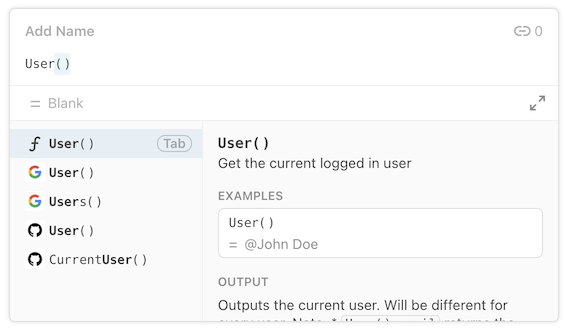
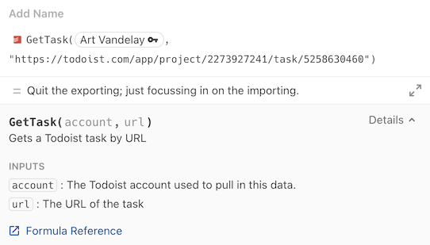

# Add custom formulas

Formulas are one of the most basic building blocks in Coda; used to calculate values, filter tables, and so much more. Coda provides a wide array of [built-in formulas][formulas], and using Packs you can add your own custom formulas. Once your Pack is installed in a doc you can use those custom formulas anywhere, intermingling them with built-in formulas or those from other Packs.

[View Sample Code][samples]{ .md-button }


!!! note
    Actions are created using formulas annotated with `isAction: true`. Action formulas are very similar to calculation formulas, but differ in some important ways. To learn more about these differences see the [Actions guide][actions].


## Structure of a formula

A formula definition consists of a set of key-value pairs, which specify the various settings for the formula. Most of these settings are metadata, such as the name, description, parameters and result type. The actual code that is run each time the formula recalculated is specified using in the `execute` key.


## Naming

The name of a formula can only contain letters, numbers, and underscores. This restriction exists to ensure that custom formulas are compatible with the Coda Formula Language. We also recommend following these conventions:

- For formulas that fetch or generate data, select a noun that corresponds to the output, using a plural if multiple can be returned. For example, `Chart` or `Tasks`.
  {: .yes}
- For formulas that transform data, select a verb that corresponds to the transformation. For example, `Reverse` or `Truncate`.
  {: .yes}
- For multiple words, use upper camel case. For example, `BugReport` or `DeletedFiles`.
  {: .yes}
- Don't include the Pack name in the name of the formula. For example, use `Task` instead of `TodoistTask`.
  {: .no}
- Avoid prefixes like `Get`, `Lookup`, or `Query`. For example, use `Tasks` instead of `GetTasks`.
  {: .no}

Formula names must be unique within a Pack, but can be the same as built-in formulas or those in other Packs. When a doc has access to multiple formulas with the same name the Pack's icon is used to distinguish them.



!!! warning
    Changing the name of a formula will break any existing docs that use it. When creating your Pack select your names carefully.


## Parameters

Formulas can accept parameters, which is the primary way for them to access data from the document. See the [Parameters guide][parameters] for more information and examples.


## Results

All formulas must return a result, which is a single value matching the type specified in the `resultType` property of the formula definition. See the [Data types guide][data-types] for more information on the type of values that can be returned.


## Authentication

Formulas can use [authentication][authentication] to fetch private data. When using [system authentication][system_auth] there is no change to the user experience, but when you use [user authentication][user_auth] the formula editor will be automatically updated to prompt for a connected account. The connected account will appear as the first parameter of the formula, but its value is not passed to your formula's `execute` function.

=== "Formula editor"
    

=== "Code"
    ```ts
    pack.setUserAuthentication({
      type: coda.AuthenticationType.HeaderBearerToken,
      instructionsUrl: "https://todoist.com/app/settings/integrations",
    });

    pack.addFormula({
      name: "GetTask",
      description: "Gets a Todoist task by URL",
      parameters: [
        coda.makeParameter({
          type: coda.ParameterType.String,
          name: "url",
          description: "The URL of the task",
        }),
      ],
      // ...
      execute: async function ([url], context) {
        // ...
      },
    });
    ```

By default if a Pack defines an authentication method then all formulas will require a connected account. You can change this behavior using the [`connectionRequirement`][connectionRequirement] property of the formula definition. Setting it to `Optional` makes the user account optional, and `None` removes the account parameter completely.

While it's possible to use multiple accounts within a document, each instance of the formula must use a specific account. It isn't possible to have a formula that uses the account of whichever user is currently viewing the document. It's important for collaboration that all users in a Coda doc have access to the same data.


## Caching

For performance reasons formula results are cached by default. If your formula is called again with the same parameters, Coda will attempt to load the result from the cache instead of re-running your code. Building or releasing a new version of your Pack will invalidate this cache, ensuring you get fresh results using your new code.

You can adjust the caching behavior by setting the [`cacheTtlSecs`][cacheTtlSecs] field on the formula definition, which specifies for how many seconds the result should be cached. To disable caching for a formula set `cacheTtlSecs` to zero.

The following types of formulas are never cached:

- [Action formulas][actions]
- [Sync formulas][sync_formula]
- Formulas that result in an error

!!! info
    In addition to caching formula results, Coda also caches the [fetcher responses][fetcher_cache]. To get truly fresh results you may need to disable that caching as well.


## Recalculation

Coda has complex logic that determines when formula results need to be recalculated. Formulas will always recalculate when the parameter values change, but it will also happen periodically for other reasons including routine maintenance. In general you shouldn't make any assumptions about how often your formula will be run. If running your formula is expensive in some way (API cost, etc) make sure to use [caching](#caching) and [rate limits][fetcher_rate_limits] to limit the impact of recalculation.

Building or releasing a new version of your Pack doesn't automatically cause existing formulas to recalculate, so users may still see old results for a while. In the **Settings** tab of the Pack's side panel there is a "Refresh now" button (**⟳**) that allows users to recalculate all formulas using the Pack. Pack makers also have access to the **Auto-refresh when version changes** toggle, which will do this automatically for the current window for each new Pack version.


## Examples

Coda automatically generates user documentation for your formulas based on the names and descriptions you assign. To demonstrate how the formula should be used you can add entries to the `examples` array. Each example is a structured object containing a set of parameters and the corresponding result, with the types matching those defined in your formula.

=== "Formula documentation"

    

=== "Code"

    ```ts
    pack.addFormula({
      name: "ToUSD",
      description: "Convert from a different currency to US dollars.",
      parameters: [
        coda.makeParameter({
          type: coda.ParameterType.Number,
          name: "amount",
          description: "The amount to convert."
        }),
        coda.makeParameter({
          type: coda.ParameterType.String,
          name: "from",
          description: "The currency to convert from."
        }),
      ],
      resultType: coda.ValueType.Number,
      examples: [
        { params: [10, "EUR"], result: 11.44 },
        { params: [12.25, "CAD"], result: 9.80 },
      ],
      // ...
    });
    ```

The parameter values are passed in the order they are defined in the formula, and all required parameters must be included. Pass the value `undefined` for any optional parameters you want to skip over.

```ts
examples: [
  // Set only the first parameter.
  { params: ["Hello"], result: "HELLO!!!" },
  // Set the first and third parameter.
  { params: ["Hello", undefined, "?"], result: "HELLO???" },
],
```


[samples]: ../../samples/topic/formula.md
[formulas]: https://coda.io/formulas
[parameters]: ../basics/parameters/index.md
[actions]: actions.md
[data-types]: ../basics/data-types.md
[cacheTtlSecs]: ../../reference/sdk/interfaces/core.PackFormulaDef.md#cachettlsecs
[fetcher_cache]: ../advanced/fetcher.md#caching
[fetcher_rate_limits]: ../advanced/fetcher.md#ratelimits
[authentication]: ../advanced/authentication/index.md
[system_auth]: ../../reference/sdk/classes/core.PackDefinitionBuilder.md#setsystemauthentication
[user_auth]: ../../reference/sdk/classes/core.PackDefinitionBuilder.md#setuserauthentication
[connectionRequirement]: ../../reference/sdk/interfaces/core.PackFormulaDef.md#connectionrequirement
[sync_formula]: sync-tables/index.md#formula
