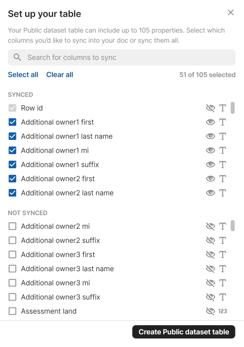

# Add sync tables

Tables are one of the most powerful features of Coda, and many times people use them to track items that are also represented in other systems. For example, you may have a table of upcoming events, each of which is already listed in a company calendar. Sync tables allow you to define a special type of table where the rows are automatically synced from an external data source such as an API.

[View Sample Code][samples]{ .md-button }


## Using sync tables

Sync tables are added directly to the document, usually by dragging them in from the side panel. Navigate to {{ coda.pack_panel_clicks }} and drag the table into the canvas.


If the sync table doesn't have any required parameters it will start syncing immediately, otherwise you'll have to configure it first. The data in the table can be synced manually or set up to sync automatically at regular intervals.

!!! info "Multiple syncs"
    Each sync table can only be added once to a document. If you want to sync data from multiple accounts or with different parameters you can add additional syncs to the table. In the table options pane click the **Add another sync** button and configure the settings. The results from all syncs will be appended to the same table, but you can use views and filters on that table to display them separately.

The data in the table is synced with the external source automatically on a schedule (at most hourly). In the table's **Options** pane users can set the sync frequency or start a manual sync. It is not possible to configure a button or automation to start a sync.


## Creating a sync table

A sync table consists of three main parts: the schema for each row of data, the sync table definition, and the formula that populates the table.


### Define the schema

Each row in a sync table corresponds to an item in an external data source. For example, the [Todoist sample][sample_todoist] has one sync table for tasks and another for projects. For each table you must define a schema that represents the data you'll be syncing for that item. See the [Schemas guide][schemas] for more information about defining and using schemas.

The item is displayed as a chip in the first column of the sync table, and it contains the complete set of synced data. Properties of the schema designated as [`featuredProperties`][featured] are automatically broken out into their own columns, but these can be removed or added to by the user later.

The schema used in a sync table can be shared by other building blocks in your Pack, like a formula or column format. Even when the schema is only used by the sync table, we recommend you define it as a separate variable in your code for readability and future reuse.

```ts
const TaskSchema = coda.makeObjectSchema({
  // ...
});
```

!!! info "Dynamic schemas"
    For some data sources it isn't possible to know the shape of the data upfront, and it can only be determined at runtime. In these cases instead of defining your schema upfront you can generate it dynamically. See the [Dynamic sync tables][dynamic_sync_tables] guide for more information.


### Define the sync table

The sync table itself is defined using the `addSyncTable()` method:

```ts
pack.addSyncTable({
  name: "Tasks",
  schema: TaskSchema,
  identityName: "Task",
  formula: {
    // ...
  },
});
```

It includes the name of the sync table, the schema for each row, and other metadata. The `identityName` property will be explained in the [Identity](#identity) section below.


### Write the sync formula {: #formula}

Inside each sync table definition is a formula definition, detailing the hidden formula used to sync data into the sync table. If you aren't already familiar with creating formulas, read the [Formulas guide][formulas] first.

```ts
pack.addSyncTable({
  // ...
  formula: {
    name: "SyncTasks",
    description: "Sync the user's tasks.",
    parameters: [],
    execute: async function ([], context) {
      // ...
    }
  },
});
```

This formula fetches items from the external data source, adjust them to fit the schema, and returns them. The return value must be a [`SyncFormulaResult`][SyncFormulaResult], which is an object where the `result` property contains the array of item objects.

```ts
pack.addSyncTable({
  // ...
  formula: {
    // ...
    execute: async function ([], context) {
      let url = "<URL to pull data from>";
      let response = await context.fetcher.fetch({
        method: "GET",
        url: url,
      });
      let items = response.body.items;
      // Adjust the items to fit the schema if required.
      return {
        result: items,
      }
    }
  },
});
```

On each sync your code must return the full set of items, and Coda will determine how to update existing rows, remove old rows, etc. This could take a long time for large datasets or slow APIs, and the [Long-running syncs](#longrunning) section has more information on how to handle this.


## Naming

The name of a sync table is visible to the user, and can only contain letters, numbers, and underscores. We recommend following these conventions:

- Select a plural noun corresponding to the item represented by each row. For example, `Products` or `Sales`.
  {: .yes}
- For multiple words, use upper camel case. For example, `BugReports`.
  {: .yes}
- Don't include the Pack name in the name of the table. For example, use `Tasks` instead of `TodoistTasks`.
  {: .no}
- Don't use adjectives in sync table names. For example, `ActiveProducts` or `RecentSales`.<br>
  In these cases it is better to have a single sync table for all items of the same type, and then add parameters that allow users to filter by certain criteria.
  {: .no}

In some areas of the UI, such as the settings pane, the name will be rewritten to add spaces ("BugReports" => "Bug Reports") for readability.

!!! warning
    Changing the name of a sync table will break any existing docs that use it. When creating your Pack select your names carefully.


## Identity {: #identity}

Every sync table is required to specify an [`identityName`][identityName], which is a unique identifier for the table. By convention this is usually the singular form of the name of the item being synced. For instance, a "Tasks" table would use an identity name of "Task". This identity name is used to reference the table when [creating row references](#references) or [updating rows with actions](#actions).

By default the identity name is also used as the column name for the first column of the sync table, which contains the synced item as a chip. You can use a different name for the column by setting [`dynamicOptions.entityName`][dynamicOptions] on the sync table.


## Parameters

The parameters defined on the sync formula are exposed to users as criteria in the sync table options. See the [parameters guide][parameters] for more information about how parameters are defined and displayed.

In most sync tables, parameters are used to allow users to filter the results in the sync table. Although users can always add filters to the resulting table to hide certain rows, it's faster and simpler to do that filtering in the sync formula itself.


## Row limits

Each sync table has a user-defined maximum number of rows, which defaults to 1000 but can be set as high as 10,000. Once a sync table reaches the limit Coda will stop the sync (even if the code returned a [continuation](#longrunning)) and truncate the resulting rows to fit within the limit.


## Long-running syncs {: #longrunning}

The sync formula that populates a sync table will timeout after a minute, but for some data sources it may take longer to retrieve all the results. In these cases you can utilize the continuation mechanism of sync tables to break your sync up into multiple executions. A continuation is like a save point, allowing you to record where you left off and then pick up again later.

If at the end of an execution there are more items left to sync, return a custom continuation object along with the synced items. Coda will then re-run your sync formula, passing in the previous continuation object. The synced items from each execution will be appended to the table. This process will continue until no continuation object is returned or the table reaches the row limit.


The contents of the continuation are flexible and will depend on the API to the external data source, but usually involve offsets or page tokens. The continuation must be an object of type [`Continuation`][Continuation], which allows for storing string and number values. Continuations are not designed for persisting large amounts of data between executions, so we recommend against using a task queue pattern.

```ts
pack.addSyncTable({
  // ...
  formula: {
    // ...
    execute: async function ([], context) {
      let previousContinuation = context.sync.continuation;
      // If there is a previous continuation, pick up where you left off.
      // Otherwise start from the beginning.

      // Sync some items...

      let nextContinuation = undefined;
      // Determine if there are more items left to sync...
      if (moreItemsLeft) {
        nextContinuation = {
          // Save your place...
        };
      }
      return {
        result: items,
        continuation: nextContinuation,
      }
    }
  },
});
```

[View Sample Code][sample_continuation]{ .md-button }


## Approximating two-way sync {: #actions}

The sync process used by sync tables is one-way only; data is pulled in from an external source and is displayed in a read-only column. It's not possible to directly edit the items in the sync table and sync the changes back out. However it is possible to approximate a two-way sync using a combinations of additional columns, buttons, and custom actions.

Learn more about this approach in the [two-way sync guide][two_way_sync].


## Referencing rows from other sync tables {: #references}

It's often the case that the different synced items in a Pack are related to each other. For example, a Pack may have sync tables for projects and tasks, where each task belongs to a single project. Using references you can connect these two tables together. References in sync tables work like [Lookup columns][hc_lookups] in regular tables.

A reference must specify the identity of the target table as well as the ID of the target row. If that row has already been synced to the doc, then the reference is replaced with the data from that row. Otherwise a grayed out chip is displayed, indicating that the referenced row hasn't been synced yet.


See the [Schemas guide][schema_references] for more information on how to create references in your table schema.

[View Sample Code][sample_reference]{ .md-button }


## Account-specific fields

Some APIs vary the shape of the data returned based on the account being accessed. For example, an issue tracker may allow users to define custom fields for their bug reports, which the API also returns. A sync table must have a defined schema that represents the data for each item, but it is possible to expand that schema to accommodate these variations by using a dynamic schema. See the [Dynamic sync tables guide][dynamic_sync_tables_schema_only] for more information on how to use this feature.


## Caching & recalculation {: #caching}

A sync table is not a live view into an external data source, but rather a snapshot of the data stored at the time of the last sync. Unlike formulas which are recalculated automatically when the parameters change, changes to sync table parameters will only be reflected during the next sync.

It's recommended that you reduce or disable [HTTP caching][fetcher_caching] of the fetcher requests used to populate your sync table. When users manually resync a table they expect the latest results, and HTTP caching can interfere with that. Caching may still be appropriate for requests that retrieve the same data during each sync formula execution.


## Columns selection

Although only [featured columns][schemas_featured_columns] are shown in the table by default, all of the schema properties are synced and stored in the object chip in the first column of the sync table. These later can be expanded out into columns of their own or accessed formulaically.

For very large schemas all of these unused properties can come with a performance cost however, so users have the option to choose the exact set of columns they want to sync. This can be done by clicking the **Choose columns** button in the sync table settings, and is launched automatically when creating the sync table with a very large schema.



Users can choose from top-level properties in the schema, and only those they select will be persisted in the document during the sync.

While there is no harm in your Pack retrieving properties that won't be persisted, in some cases you can optimize your sync if you know the exact set of fields the user is requesting. This can be determined by inspecting the value of `context.sync.schema`. This will be a copy of the original schema, but with only properties that the user selected.

Since the properties themselves may use the [`fromKey`][fromKey] option to load their value from a different field in the row objects, it can be somewhat involved to map the properties back to API fields. To assist with this there is a helper function [`coda.getEffectivePropertyKeysFromSchema()`][getEffectivePropertyKeysFromSchema] that will do the conversion for you.

??? example "Example: Open Data NY sync table"
    ```ts
    --8<-- "samples/packs/dynamic-sync-table/open_data_ny.ts"
    ```

[samples]: ../../../samples/topic/sync-table.md
[help_center]: https://help.coda.io/en/articles/3213629-using-packs-tables-to-sync-your-data-into-coda
[sample_todoist]: ../../../samples/full/todoist.md
[schemas]: ../../advanced/schemas.md
[featured]: ../../../reference/sdk/interfaces/core.ObjectSchemaDefinition.md#featuredproperties
[formulas]: ../formulas.md
[SyncFormulaResult]: ../../../reference/sdk/interfaces/core.SyncFormulaResult.md
[Continuation]: ../../../reference/sdk/interfaces/core.Continuation.md
[identityName]: ../../../reference/sdk/interfaces/core.SyncTableOptions.md#identityname
[schema_references]: ../../advanced/schemas.md#references
[dynamicOptions]: ../../../reference/sdk/interfaces/core.SyncTableOptions/#dynamicoptions
[actions]: ../actions.md
[dynamic_sync_tables]: dynamic.md
[dynamic_sync_tables_schema_only]: dynamic.md#schema-only
[hc_lookups]: https://help.coda.io/en/articles/1385997-using-lookups#the-lookup-column-format
[sample_continuation]: ../../../samples/topic/sync-table.md#with-continuation
[sample_reference]: ../../../samples/topic/sync-table.md#with-row-references
[parmeters]: ../../basics/parameters/index.md
[fetcher_caching]: ../../basics/fetcher.md#caching
[parameters]: ../../basics/parameters/index.md
[two_way_sync]: ../../advanced/two-way-sync.md
[schemas_featured_columns]: ../../advanced/schemas.md#featured-columns
[getEffectivePropertyKeysFromSchema]: ../../../reference/sdk/functions/core.getEffectivePropertyKeysFromSchema.md
[fromKey]: ../../../reference/sdk/interfaces/core.ObjectSchemaProperty.md#fromkey
