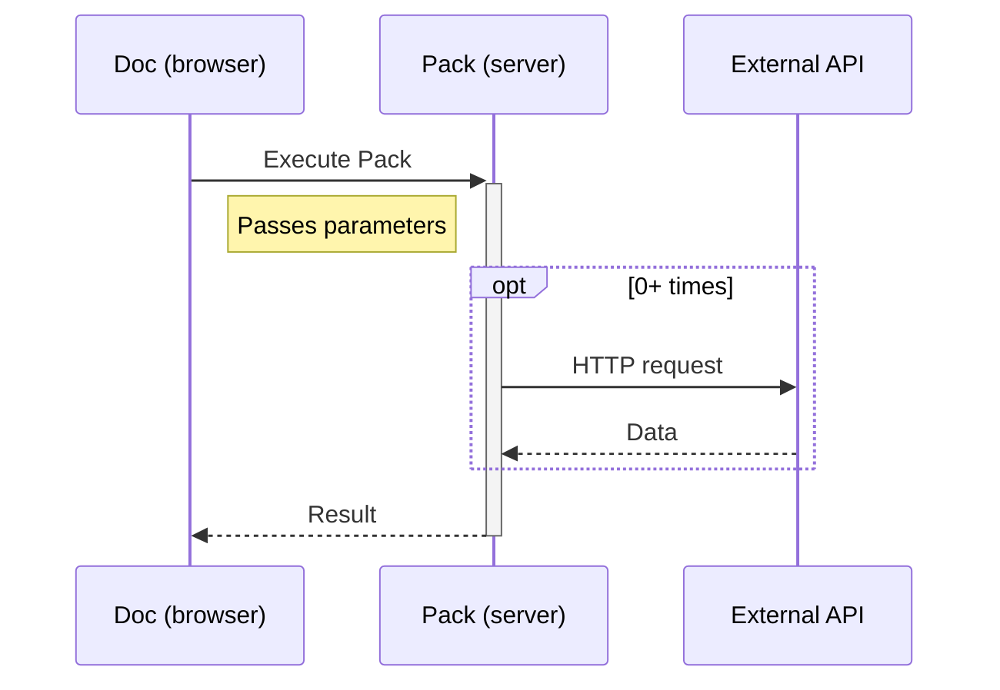

# What are Packs?

_A Pack is an extension that adds new powers to your doc._

What other platforms call plugins, add-ons, or extensions, we call "Packs". A Pack extends the core building blocks of Coda, allowing users to build more powerful and integrated docs. Anyone can build a Pack, and they can use it in their own docs, share it with their team, or publish it to the world.

Packs are built using JavaScript or TypeScript, either on your local machine or in the browser, and run on Coda's own servers. We have a [gallery][gallery_packs] where users can discover and install Packs, as well as a robust set of [admin controls][help_admin].

[Packs overview][packs_landing]{ .md-button }
[Why build Packs?][packs_why]{ .md-button }

## What can Packs do?

Packs can extend Coda in four specific ways:

=== "Formulas"

    Packs can add new formulas for the [Coda formula language][formula_list]. These formulas can do simple calculations, call a library, or pull in data from an external source.

    <figure>
      
      <figcaption>A formula from the Google Calendar Pack which looks up when the user has busy time on their calendar.</figcaption>
    </figure>

    [Learn more][formulas]{ .md-button }

=== "Actions"

    Packs can add new actions, which are a special type of formula that powers [buttons][help_buttons] and [automations][help_automations]. These actions typically make a change in an external application.

    <figure>
      
      <figcaption>A button being configured with an action from the Google Calendar Pack that creates a new event in the user's calendar.</figcaption>
    </figure>

    [Learn more][actions]{ .md-button }

=== "Column formats"

    Packs can add new [column formats][help_format], which control how values are displayed within a table. They can simply reformat the data or enrich it with related information from an external source.

    <figure>
      
      <figcaption>A column format from the Google Calendar Pack that displays rich information about an event provided its URL.</figcaption>
    </figure>

    [Learn more][column_formats]{ .md-button }

=== "Pack tables"

    Packs can add [Pack tables][help_pack_table], which are a special type of table that automatically syncs in data from an outside source. These tables are often used to bring in records from other apps or productivity tools.

    <figure>
      
      <figcaption>A table from the Google Calendar Pack that pulls in the upcoming events on a user's calendar.</figcaption>
    </figure>

    [Learn more][sync_tables]{ .md-button }

## Who can build Packs?

Anyone with a Coda account is able to build a Pack, and getting started is as easy as clicking the "Create a Pack" button in the app. Our Pack Studio comes bundled with all the tools you'll need to write, build, and deploy a Pack, all without leaving your browser. And for more advanced developers we provide a command-line tool, allowing you to use your favorite IDE, tooling, and version control system.

You will need to have a basic understanding of JavaScript or TypeScript to be successful, so if you're new to coding an [online JavaScript course][codecademy] might be a good place to start. We also have a large library of examples and templates built into the Pack Studio, plus a [friendly community][community] of fellow Pack makers that can help you along the way.

[Build your first Pack][quickstart_web]{ .md-button }

## How do Packs work?

Each Pack is its own [serverless application][wikipedia_serverless], fully managed and run by Coda. All you have to do is write the code and we'll take care of the rest.

All Pack code is run on the server, ensuring a consistent and secure environment. Each execution of a Pack can run for at most a minute, but there are features that allow for longer running operations.

Unlike other scripting languages, Packs don't automatically have access to all of the data within the doc. Instead users pass the Pack only the specific parameters it requires. Packs can then make requests to external APIs to fetch more data, including our own [Coda API][api].

Packs are run in a custom JavaScript execution environment created by Coda, compatible with the [ES2022 standard][mdn_ecmascript]. You can use all the modern JavaScript features, but browser- and Node-specific objects are not available (`window`, `fs`, etc).

[packs_landing]: https://coda.io/packs
[packs_why]: https://coda.io/why-build-packs
[gallery_slack]: https://coda.io/packs/slack-1000
[formula_list]: https://coda.io/formulas
[help_buttons]: https://help.coda.io/en/articles/2033889-overview-of-buttons
[help_automations]: https://help.coda.io/en/articles/2423860-automations-in-coda
[help_format]: https://help.coda.io/en/articles/1235680-overview-of-column-formats
[help_pack_table]: https://help.coda.io/en/articles/3213629-using-packs-tables-to-sync-your-data-into-coda
[codecademy]: https://www.codecademy.com/learn/introduction-to-javascript
[community]: https://community.coda.io/c/developers-central/making-packs/15
[quickstart_web]: ../tutorials/get-started/web.md
[quickstart_cli]: ../tutorials/get-started/cli.md
[wikipedia_serverless]: https://en.wikipedia.org/wiki/Serverless_computing
[mdn_ecmascript]: https://developer.mozilla.org/en-US/docs/Web/JavaScript/Language_Resources
[api]: https://coda.io/developers/apis/v1
[formulas]: blocks/formulas.md
[actions]: blocks/actions.md
[column_formats]: blocks/column-formats.md
[sync_tables]: blocks/sync-tables/index.md
[help_admin]: https://help.coda.io/en/articles/5574990-managing-packs-approvals-for-enterprise-admins
[gallery_packs]: https://coda.io/gallery?filter=packs
