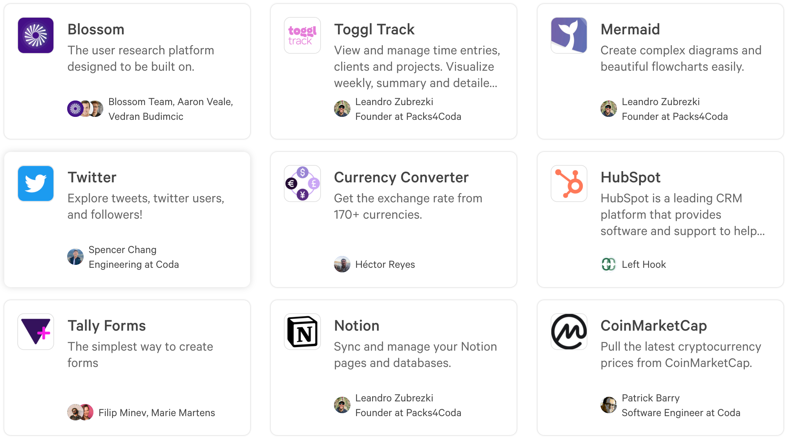

# Build Packs for Coda

A Pack is an extension that adds new powers to your doc. Packs work by supplementing the core building blocks of Coda, so you can customize how your doc looks, works, and integrates.

<section class="landing-row" markdown>

## :material-toy-brick-outline: Let’s build building blocks together.

With a little JavaScript, anyone can create and publish a Pack to the Gallery. All you need to do is write the code and Coda will deploy and host the Pack for you.

Packs can be created for personal use, shared with a team, or published to the world. Everything from simple utilities to rich integrations can be built with Packs.

[Learn more][overview]{ .md-button .md-button--primary }

</section>

---

<section class="landing-row landing-row-reverse" markdown>

## :octicons-stopwatch-16: Build your first Pack in minutes.

Using Coda's Pack Studio you can write, build, and deploy your Pack all from your browser. Nothing to download or install.

[Get started][get_started]{ .md-button .md-button--primary }

Or for you power users, build a Pack using the `coda` command line tool on your [local machine][tutorial_cli], [GitHub :octicons-mark-github-16:][tutorial_github], [Gitpod :simple-gitpod:][tutorial_gitpod], or [Replit :simple-replit:][tutorial_replit].

</section>

 

<section class="box-row" markdown>

### :octicons-terminal-16: Command line tool

Use the CLI to develop Packs on your local machine, where you can use the IDE, tooling, and version control of your choice.

[Install CLI][cli]{ .md-button }

### :material-application-braces-outline: Sample code

From Math to GitHub to Cat Photos, we've got dozens of examples written covering all major aspects of the SDK.

[Browse samples][samples]{ .md-button }

### :fontawesome-solid-people-group: Community

Our passionate community of Pack makers and Coda experts can help answer your questions or share tips to get you started.

[Join the community][community]{ .md-button }

</section>

 

<section class="landing-row" markdown>

<iframe width="560" height="315" src="https://www.youtube.com/embed/OoR1qX9w4Js" title="YouTube video player: Build a Todoist Coda Pack from Scratch" frameborder="0" allow="accelerometer; autoplay; clipboard-write; encrypted-media; gyroscope; picture-in-picture" allowfullscreen></iframe>

## :material-youtube: Grab the popcorn.

In this snippet from a recent webinar we demonstrate how to build a Pack from scratch that retrieves your task list from Todoist :simple-todoist:. It was created in under 10 minutes and with less than 30 lines of code in the Pack Studio.

[Watch webinars][webinars]{ .md-button }

</section>

<section class="landing-row" markdown>

## :fontawesome-regular-lightbulb: Get inspired.

Coda makers have been busy building Packs of all types, and many have published their work to the Gallery. Try installing a few Packs to get a sense for what you could build.

[Browse the Gallery][gallery]{ .md-button }

</section>

[overview]: guides/overview.md
[get_started]: tutorials/get-started/web.md
[cli]: guides/development/cli.md
[samples]: samples/index.md
[changelog]: reference/changes.md
[community]: https://community.coda.io/c/developers-central/making-packs/15
[gallery]: https://coda.io/gallery?filter=packs
[webinars]: tutorials/webinars.md
[tutorial_cli]: tutorials/get-started/cli.md
[tutorial_github]: tutorials/get-started/github.md
[tutorial_gitpod]: tutorials/get-started/gitpod.md
[tutorial_replit]: tutorials/get-started/replit.md
